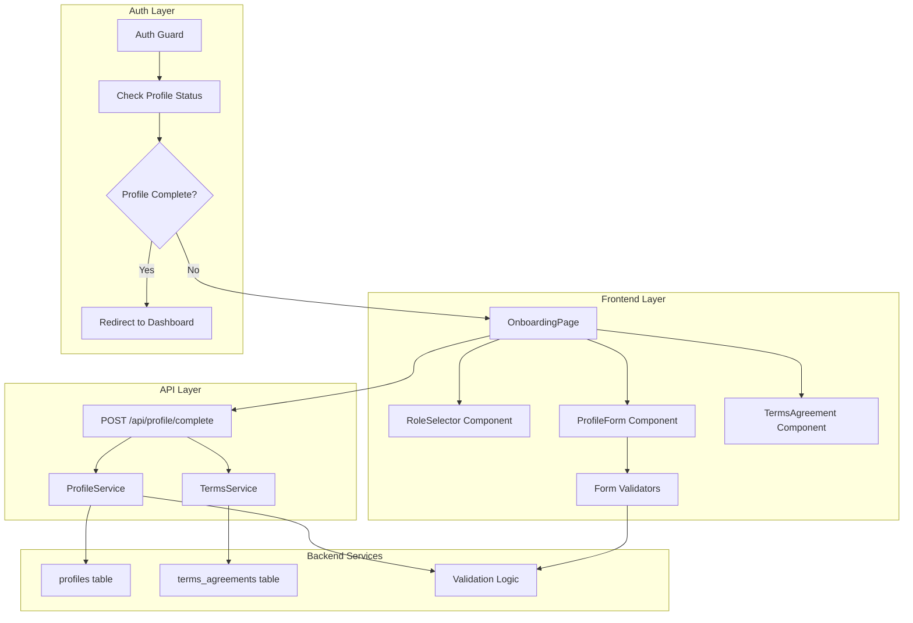

# 역할 선택 & 온보딩 모듈화 설계

## 개요

### 모듈 목록

| 모듈 이름 | 위치 | 설명 |
|----------|------|------|
| **Profile Feature** | `src/features/profile/` | 사용자 프로필 관련 비즈니스 로직 |
| **Onboarding Feature** | `src/features/onboarding/` | 온보딩 플로우 전용 기능 |
| **Terms Component** | `src/components/terms/` | 약관 동의 공통 컴포넌트 |
| **Role Selector** | `src/components/role/` | 역할 선택 공통 컴포넌트 |
| **Form Validators** | `src/lib/validators/` | 공통 폼 검증 유틸리티 |
| **Auth Guards** | `src/lib/guards/` | 인증 및 프로필 완성도 체크 |

## Diagram



## Implementation Plan

### 1. Backend Modules

#### 1.1 Profile Feature Backend (`src/features/profile/backend/`)

**route.ts**
- `POST /api/profile/complete` - 프로필 완성 처리
- `GET /api/profile/status` - 프로필 완성도 확인
- Zod 스키마를 통한 요청 검증
- 트랜잭션으로 프로필 + 약관 동시 저장

**service.ts**
- `completeProfile()` - 프로필 정보 저장
- `checkProfileCompletion()` - 프로필 완성도 확인
- `getUserRole()` - 사용자 역할 조회
- Supabase 트랜잭션 처리

**schema.ts**
```typescript
- CompleteProfileRequestSchema
- ProfileResponseSchema
- ProfileStatusSchema
```

**error.ts**
- `PROFILE_ALREADY_EXISTS`
- `INVALID_ROLE`
- `PROFILE_UPDATE_FAILED`

#### 1.2 Terms Feature Backend (`src/features/terms/backend/`)

**service.ts**
- `saveTermsAgreement()` - 약관 동의 저장
- `getLatestTermsVersion()` - 최신 약관 버전 조회
- `hasAgreedToTerms()` - 약관 동의 여부 확인

### 2. Frontend Modules

#### 2.1 Onboarding Page (`src/app/auth/onboarding/page.tsx`)

**주요 기능**
- 단계별 온보딩 플로우 (역할 선택 → 프로필 입력 → 약관 동의)
- 각 단계별 상태 관리 (zustand 사용)
- 완료 후 역할별 리다이렉션

**QA Sheet**
- [ ] 역할 선택 없이 다음 단계 진행 차단 확인
- [ ] 필수 필드 미입력 시 에러 메시지 표시 확인
- [ ] 전화번호 형식 검증 (010-xxxx-xxxx) 확인
- [ ] 약관 미동의 시 진행 차단 확인
- [ ] 프로필 저장 실패 시 에러 처리 확인
- [ ] Learner 선택 시 `/courses` 리다이렉션 확인
- [ ] Instructor 선택 시 `/dashboard/instructor` 리다이렉션 확인

#### 2.2 Role Selector Component (`src/components/role/RoleSelector.tsx`)

**Props**
```typescript
interface RoleSelectorProps {
  value?: 'learner' | 'instructor';
  onChange: (role: 'learner' | 'instructor') => void;
  disabled?: boolean;
}
```

**QA Sheet**
- [ ] 역할 카드 hover 효과 동작 확인
- [ ] 선택된 역할 하이라이트 표시 확인
- [ ] disabled 상태에서 클릭 차단 확인

#### 2.3 Profile Form Component (`src/components/profile/ProfileForm.tsx`)

**주요 기능**
- react-hook-form 기반 폼 관리
- zod 스키마 기반 클라이언트 검증
- 실시간 유효성 검사 피드백

**QA Sheet**
- [ ] 이름 필드 최소 2자 이상 검증 확인
- [ ] 전화번호 자동 포맷팅 (하이픈 추가) 확인
- [ ] 필드별 에러 메시지 표시 확인

### 3. Shared Modules

#### 3.1 Form Validators (`src/lib/validators/profile.ts`)

```typescript
export const phoneNumberValidator = z.string()
  .regex(/^010-\d{4}-\d{4}$/, '올바른 전화번호 형식이 아닙니다');

export const nameValidator = z.string()
  .min(2, '이름은 2자 이상이어야 합니다')
  .max(50, '이름은 50자 이하여야 합니다');
```

#### 3.2 Auth Guards (`src/lib/guards/profile.ts`)

```typescript
export async function requireCompleteProfile() {
  const profile = await getProfile();
  if (!profile?.name || !profile?.phone) {
    redirect('/auth/onboarding');
  }
}
```

### 4. Unit Tests

#### 4.1 Backend Service Tests (`src/features/profile/backend/__tests__/service.test.ts`)

```typescript
describe('ProfileService', () => {
  it('should save profile with valid data');
  it('should reject duplicate role assignment');
  it('should handle transaction rollback on failure');
  it('should validate phone number format');
});
```

#### 4.2 Validation Tests (`src/lib/validators/__tests__/profile.test.ts`)

```typescript
describe('Profile Validators', () => {
  it('should accept valid Korean phone numbers');
  it('should reject invalid phone formats');
  it('should validate name length constraints');
});
```

### 5. Integration Points

#### 5.1 With Auth System
- Supabase Auth user ID 연동
- 세션 기반 사용자 확인
- 프로필 완성도에 따른 라우팅 제어

#### 5.2 With Other Features
- 코스 기능에서 역할 확인
- 대시보드에서 역할별 UI 렌더링
- 과제 제출 시 학습자 역할 검증

### 6. Migration Requirements

**추가 필요 테이블 (이미 database.md에 정의됨)**
- `profiles` 테이블 - 기본 구조 유지
- `terms_agreements` 테이블 - 기본 구조 유지
- updated_at 트리거 추가 필요

### 7. State Management

**Zustand Store** (`src/features/onboarding/store.ts`)
```typescript
interface OnboardingStore {
  step: 'role' | 'profile' | 'terms' | 'complete';
  role: 'learner' | 'instructor' | null;
  profileData: ProfileFormData | null;
  setStep: (step: Step) => void;
  setRole: (role: Role) => void;
  setProfileData: (data: ProfileFormData) => void;
  reset: () => void;
}
```

### 8. Error Handling Strategy

1. **Client-side validation** - 즉각적인 피드백
2. **Server-side validation** - 보안 및 데이터 무결성
3. **Transaction rollback** - 부분 실패 방지
4. **User-friendly messages** - 한국어 에러 메시지
5. **Retry mechanism** - 네트워크 오류 대응

### 9. Performance Considerations

1. **Lazy loading** - 역할별 컴포넌트 동적 로딩
2. **Optimistic updates** - 즉각적인 UI 반응
3. **Debounced validation** - 입력 중 과도한 검증 방지
4. **Memoization** - 불필요한 리렌더링 방지

### 10. Security Considerations

1. **Role tampering prevention** - 서버에서 역할 재검증
2. **SQL injection prevention** - Parameterized queries
3. **XSS prevention** - 입력 값 sanitization
4. **CSRF protection** - Supabase 기본 제공
5. **Rate limiting** - 프로필 생성 요청 제한