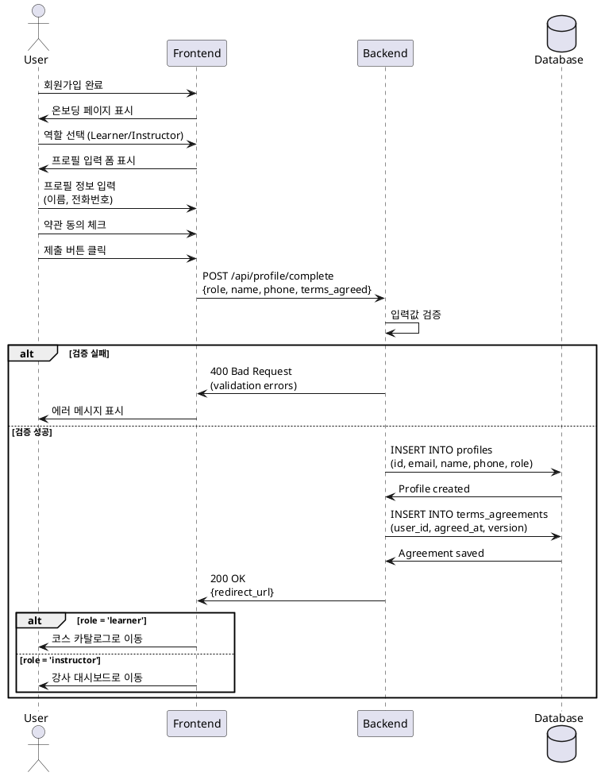

# 역할 선택 & 온보딩 유스케이스

## Primary Actor
신규 사용자 (아직 역할이 정해지지 않은 상태)

## Precondition
- 사용자가 회원가입을 완료함
- Supabase Auth에 계정이 생성됨
- 아직 프로필 정보가 입력되지 않음

## Trigger
회원가입 완료 후 자동으로 온보딩 페이지로 리다이렉트

## Main Scenario
1. 사용자가 역할 선택 화면을 확인함 (Learner / Instructor)
2. 사용자가 원하는 역할을 선택함
3. 시스템이 선택한 역할에 맞는 프로필 입력 폼을 표시함
4. 사용자가 필수 정보를 입력함 (이름, 휴대폰번호)
5. 사용자가 이용약관에 동의함
6. 시스템이 프로필 정보를 저장함
7. 시스템이 약관 동의 이력을 저장함
8. 시스템이 역할에 맞는 대시보드로 리다이렉트함
   - Learner → 코스 카탈로그
   - Instructor → 강사 대시보드

## Edge Cases
- **E1: 필수 정보 누락**
  - 시스템이 누락된 필드를 표시하고 입력 요청
- **E2: 잘못된 전화번호 형식**
  - 시스템이 올바른 형식 안내 메시지 표시
- **E3: 약관 미동의**
  - 시스템이 진행 차단하고 약관 동의 필요 안내
- **E4: 프로필 저장 실패**
  - 시스템이 에러 메시지 표시하고 재시도 안내

## Business Rules
- 역할은 한 번 선택하면 변경 불가
- 모든 필수 필드가 입력되어야 진행 가능
- 약관 동의는 필수
- 프로필 정보는 profiles 테이블에 저장
- 약관 동의 이력은 terms_agreements 테이블에 저장

## Sequence Diagram

