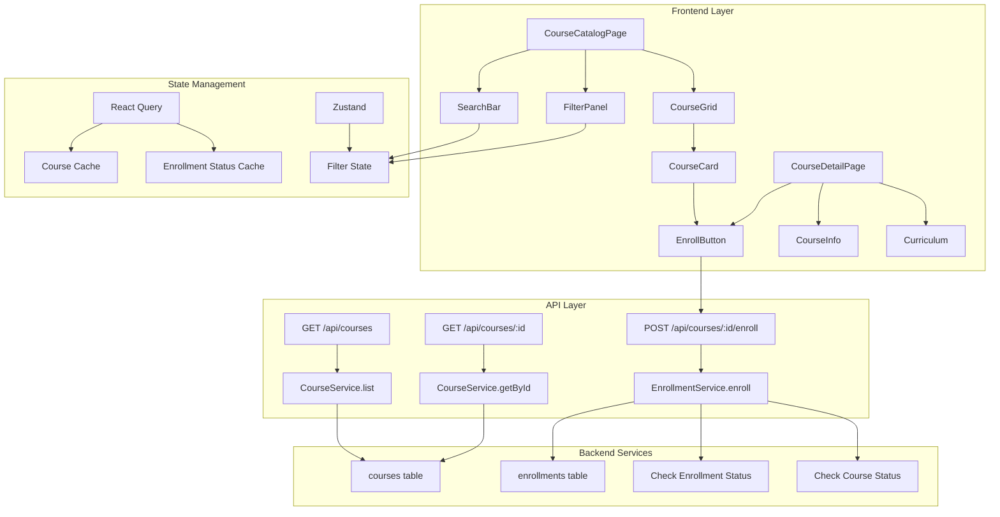

# 코스 탐색 & 수강신청 모듈화 설계

## 개요

### 모듈 목록

| 모듈 이름 | 위치 | 설명 |
|----------|------|------|
| **Course Feature** | `src/features/course/` | 코스 관련 핵심 비즈니스 로직 |
| **Enrollment Feature** | `src/features/enrollment/` | 수강신청 관련 기능 |
| **Course Catalog** | `src/components/course/catalog/` | 코스 목록 UI 컴포넌트 |
| **Course Card** | `src/components/course/card/` | 코스 카드 재사용 컴포넌트 |
| **Filter Components** | `src/components/filters/` | 검색/필터 공통 컴포넌트 |
| **Pagination** | `src/components/pagination/` | 페이지네이션 공통 컴포넌트 |

## Diagram



## Implementation Plan

### 1. Backend Modules

#### 1.1 Course Feature Backend (`src/features/course/backend/`)

**route.ts**
- `GET /api/courses` - 코스 목록 조회 (필터링/정렬)
- `GET /api/courses/:id` - 코스 상세 조회
- 쿼리 파라미터 파싱 및 검증

**service.ts**
- `listCourses()` - 필터링된 코스 목록 조회
- `getCourseById()` - 코스 상세 정보 조회
- `getCourseStats()` - 수강생 수, 평점 등 통계
- 동적 쿼리 빌더 구현

**schema.ts**
```typescript
- CourseListQuerySchema
- CourseResponseSchema
- CourseDetailSchema
```

**error.ts**
- `COURSE_NOT_FOUND`
- `COURSE_NOT_PUBLISHED`
- `INVALID_FILTER_PARAMS`

#### 1.2 Enrollment Feature Backend (`src/features/enrollment/backend/`)

**route.ts**
- `POST /api/courses/:id/enroll` - 수강신청
- `DELETE /api/courses/:id/enroll` - 수강취소
- `GET /api/my-courses` - 내 수강 목록

**service.ts**
- `enrollInCourse()` - 수강신청 처리
- `checkEnrollmentStatus()` - 수강 상태 확인
- `unenrollFromCourse()` - 수강취소 처리
- `getMyEnrollments()` - 내 수강 목록 조회

**Unit Tests**
```typescript
describe('EnrollmentService', () => {
  it('should prevent duplicate enrollment');
  it('should only allow enrollment in published courses');
  it('should only allow learners to enroll');
  it('should handle concurrent enrollment attempts');
});
```

### 2. Frontend Modules

#### 2.1 Course Catalog Page (`src/app/courses/page.tsx`)

**주요 기능**
- 무한 스크롤 또는 페이지네이션
- 실시간 필터링/검색
- 정렬 옵션 (최신순/인기순)
- 로딩/에러 상태 처리

**QA Sheet**
- [ ] 필터 적용 시 URL 쿼리 파라미터 동기화
- [ ] 빈 검색 결과 시 적절한 메시지 표시
- [ ] 필터 초기화 기능 동작 확인
- [ ] 페이지네이션 경계값 처리 확인
- [ ] 카테고리별 필터링 정확성 확인
- [ ] 난이도별 필터링 정확성 확인
- [ ] 정렬 옵션 변경 시 즉시 반영 확인

#### 2.2 Course Detail Page (`src/app/courses/[courseId]/page.tsx`)

**주요 기능**
- 코스 정보 표시
- 커리큘럼 목록
- 강사 프로필
- 수강신청 버튼 상태 관리

**QA Sheet**
- [ ] 비공개(draft) 코스 접근 시 404 처리
- [ ] 이미 수강 중인 코스 버튼 상태 확인
- [ ] 수강신청 성공 시 즉시 상태 변경
- [ ] 수강신청 실패 시 에러 메시지 표시
- [ ] 로그인하지 않은 사용자 수강신청 차단

#### 2.3 Course Card Component (`src/components/course/card/CourseCard.tsx`)

**Props**
```typescript
interface CourseCardProps {
  course: Course;
  isEnrolled?: boolean;
  onEnroll?: () => void;
  variant?: 'grid' | 'list';
}
```

**QA Sheet**
- [ ] 카드 호버 효과 동작 확인
- [ ] 난이도 뱃지 색상 구분 확인
- [ ] 카테고리 태그 표시 확인
- [ ] 수강생 수 포맷팅 확인

### 3. Shared Components

#### 3.1 Filter Panel (`src/components/filters/CourseFilterPanel.tsx`)

**Features**
- 카테고리 다중 선택
- 난이도 단일 선택
- 필터 상태 지속성

#### 3.2 Search Bar (`src/components/search/SearchBar.tsx`)

**Features**
- Debounced search
- Clear button
- Search suggestions (optional)

### 4. State Management

#### 4.1 React Query Hooks (`src/features/course/hooks/`)

```typescript
// useCoursesQuery.ts
export function useCoursesQuery(filters: CourseFilters) {
  return useQuery({
    queryKey: ['courses', filters],
    queryFn: () => fetchCourses(filters),
    keepPreviousData: true,
  });
}

// useEnrollMutation.ts
export function useEnrollMutation() {
  return useMutation({
    mutationFn: enrollInCourse,
    onSuccess: () => {
      queryClient.invalidateQueries(['enrollments']);
      queryClient.invalidateQueries(['courses']);
    },
  });
}
```

#### 4.2 Zustand Store (`src/features/course/store/filter.ts`)

```typescript
interface CourseFilterStore {
  category: string[];
  difficulty: DifficultyLevel | null;
  searchQuery: string;
  sortBy: 'latest' | 'popular';
  setCategory: (categories: string[]) => void;
  setDifficulty: (level: DifficultyLevel | null) => void;
  setSearchQuery: (query: string) => void;
  setSortBy: (sort: SortOption) => void;
  reset: () => void;
}
```

### 5. API Client (`src/features/course/lib/api-client.ts`)

```typescript
export const courseApi = {
  list: (params: CourseListParams) =>
    apiClient.get('/api/courses', { params }),

  getById: (id: string) =>
    apiClient.get(`/api/courses/${id}`),

  enroll: (courseId: string) =>
    apiClient.post(`/api/courses/${courseId}/enroll`),

  unenroll: (courseId: string) =>
    apiClient.delete(`/api/courses/${courseId}/enroll`),
};
```

### 6. SEO & Performance

#### 6.1 SEO Optimization
- Server-side rendering for catalog page
- Dynamic metadata for course details
- Structured data for courses

#### 6.2 Performance
- Image lazy loading
- Virtual scrolling for large lists
- Prefetch course details on hover
- Optimistic UI updates

### 7. Accessibility

- Keyboard navigation support
- ARIA labels for filters
- Screen reader friendly course cards
- Focus management on filter changes

### 8. Error Handling

1. **Network errors** - Retry with exponential backoff
2. **409 Conflict** - "이미 수강 중입니다" 메시지
3. **403 Forbidden** - 역할 기반 접근 제한 안내
4. **404 Not Found** - 코스 없음 안내
5. **422 Unprocessable** - 상태 관련 오류 (draft 코스 등)

### 9. Integration Points

#### 9.1 With Auth System
- 로그인 상태 확인
- Learner 역할 검증
- 세션 기반 수강 상태

#### 9.2 With Profile System
- 사용자 정보 표시
- 역할별 UI 변경

#### 9.3 With Assignment System
- 수강 중인 코스의 과제 접근
- 수강 상태 기반 과제 제출 권한