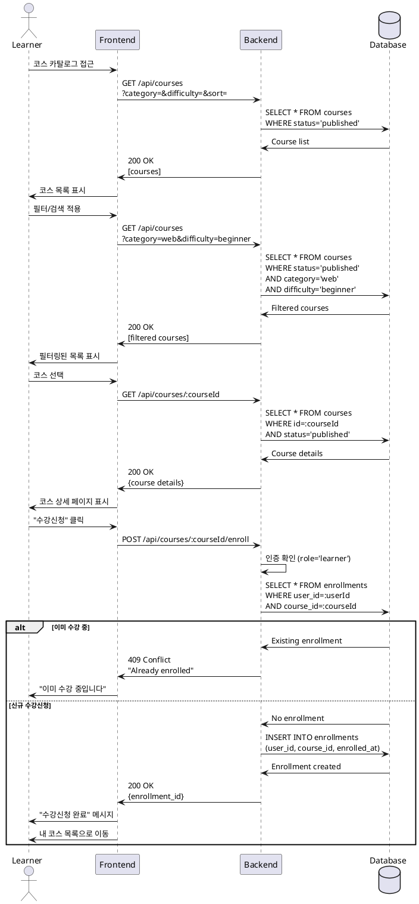

# 코스 탐색 & 수강신청 유스케이스

## Primary Actor
학습자 (Learner 역할)

## Precondition
- 사용자가 Learner 역할로 로그인함
- 프로필 정보가 완성됨
- 코스 카탈로그에 published 상태의 코스가 존재함

## Trigger
학습자가 코스 카탈로그 페이지에 접근

## Main Scenario
1. 학습자가 코스 목록을 확인함
2. 학습자가 검색 또는 필터를 적용함 (선택)
   - 카테고리별 필터링
   - 난이도별 필터링 (beginner/intermediate/advanced)
   - 정렬 옵션 선택 (최신순/인기순)
3. 시스템이 필터링된 코스 목록을 표시함
4. 학습자가 관심 있는 코스를 선택함
5. 시스템이 코스 상세 정보를 표시함
   - 코스 제목, 설명
   - 강사 정보
   - 커리큘럼
   - 수강생 수, 평점
6. 학습자가 "수강신청" 버튼을 클릭함
7. 시스템이 수강 가능 여부를 확인함
8. 시스템이 enrollments 테이블에 기록을 생성함
9. 시스템이 수강신청 완료 메시지를 표시함
10. 학습자가 "내 코스" 목록에서 등록된 코스를 확인함

## Edge Cases
- **E1: 이미 수강 중인 코스**
  - 시스템이 "이미 수강 중입니다" 메시지 표시
  - 수강신청 버튼 대신 "내 코스로 이동" 버튼 표시
- **E2: Draft/Archived 상태 코스 접근 시도**
  - 시스템이 404 에러 또는 "코스를 찾을 수 없습니다" 메시지 표시
- **E3: 수강신청 중 네트워크 오류**
  - 시스템이 에러 메시지 표시하고 재시도 옵션 제공
- **E4: 동시 수강신청 (동일 코스에 대한 중복 요청)**
  - 시스템이 중복 방지 (UNIQUE constraint)

## Business Rules
- published 상태의 코스만 수강신청 가능
- 한 코스에 대해 학습자당 하나의 enrollment만 가능
- 수강 취소 후 재신청 가능
- Learner 역할만 수강신청 가능

## Sequence Diagram

