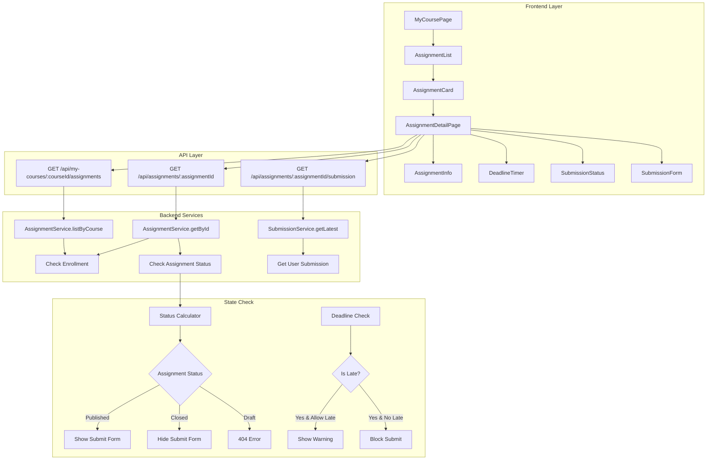

# 과제 상세 열람 모듈화 설계

## 개요

### 모듈 목록

| 모듈 이름 | 위치 | 설명 |
|----------|------|------|
| **Assignment Feature** | `src/features/assignment/` | 과제 관련 핵심 비즈니스 로직 |
| **Assignment Display** | `src/components/assignment/display/` | 과제 표시 컴포넌트 |
| **Status Badge** | `src/components/ui/status-badge/` | 상태 표시 공통 컴포넌트 |
| **Deadline Timer** | `src/components/ui/deadline-timer/` | 마감 시간 카운트다운 |
| **Permission Guards** | `src/lib/guards/assignment.ts` | 과제 접근 권한 검증 |

## Diagram



## Implementation Plan

### 1. Backend Modules

#### 1.1 Assignment Feature Backend (`src/features/assignment/backend/`)

**route.ts**
- `GET /api/my-courses/:courseId/assignments` - 코스별 과제 목록
- `GET /api/assignments/:assignmentId` - 과제 상세 조회
- 수강 권한 검증 미들웨어

**service.ts**
- `getAssignmentById()` - 과제 상세 정보 조회
- `listAssignmentsByCourse()` - 코스의 과제 목록
- `getAssignmentWithSubmission()` - 과제 + 제출 정보
- `checkAssignmentAccess()` - 접근 권한 확인
- `calculateSubmissionStatus()` - 제출 가능 여부 계산

**schema.ts**
```typescript
- AssignmentDetailSchema
- AssignmentListSchema
- AssignmentAccessSchema
- SubmissionStatusSchema
```

**error.ts**
- `ASSIGNMENT_NOT_FOUND`
- `ASSIGNMENT_NOT_PUBLISHED`
- `NOT_ENROLLED_IN_COURSE`
- `ASSIGNMENT_ACCESS_DENIED`

**Unit Tests**
```typescript
describe('AssignmentService', () => {
  it('should only show published assignments to learners');
  it('should include submission status for enrolled users');
  it('should calculate deadline correctly with timezone');
  it('should determine late submission eligibility');
});
```

### 2. Frontend Modules

#### 2.1 Assignment Detail Page (`src/app/my-courses/[courseId]/assignments/[assignmentId]/page.tsx`)

**주요 기능**
- 과제 정보 표시
- 실시간 마감 카운트다운
- 제출 상태 표시
- 제출 폼 조건부 렌더링

**QA Sheet**
- [ ] 미수강 코스 과제 접근 시 403 에러 처리
- [ ] Draft 상태 과제 접근 시 404 처리
- [ ] 마감 시간 실시간 업데이트 확인
- [ ] 지각 제출 가능 과제 경고 메시지 표시
- [ ] 마감된 과제 제출 폼 비활성화 확인
- [ ] 이미 제출한 과제 상태 표시 정확성
- [ ] 재제출 가능 여부에 따른 UI 변경

#### 2.2 Assignment List Component (`src/components/assignment/list/AssignmentList.tsx`)

**Props**
```typescript
interface AssignmentListProps {
  courseId: string;
  enrollmentId: string;
  showStatus?: boolean;
  variant?: 'compact' | 'detailed';
}
```

**QA Sheet**
- [ ] 과제 목록 정렬 (마감일순) 확인
- [ ] 각 과제 상태 뱃지 표시 확인
- [ ] 마감 임박 과제 강조 표시
- [ ] 빈 과제 목록 메시지 표시

#### 2.3 Deadline Timer Component (`src/components/ui/deadline-timer/DeadlineTimer.tsx`)

**Features**
- 실시간 카운트다운
- 시간대별 색상 변경 (72h, 24h, 1h)
- 마감 후 "마감됨" 표시

**Props**
```typescript
interface DeadlineTimerProps {
  deadline: Date;
  onExpire?: () => void;
  showSeconds?: boolean;
  variant?: 'inline' | 'block';
}
```

### 3. Shared Modules

#### 3.1 Assignment Guards (`src/lib/guards/assignment.ts`)

```typescript
export async function requireEnrollment(courseId: string) {
  const enrollment = await checkEnrollment(courseId);
  if (!enrollment) {
    throw new ForbiddenError('수강 등록이 필요합니다');
  }
  return enrollment;
}

export async function requirePublishedAssignment(assignment: Assignment) {
  if (assignment.status !== 'published' && assignment.status !== 'closed') {
    throw new NotFoundError('과제를 찾을 수 없습니다');
  }
}
```

#### 3.2 Status Calculators (`src/lib/utils/assignment-status.ts`)

```typescript
export function canSubmitAssignment(
  assignment: Assignment,
  currentTime: Date
): { canSubmit: boolean; reason?: string } {
  if (assignment.status === 'closed') {
    return { canSubmit: false, reason: '마감된 과제입니다' };
  }

  if (currentTime > assignment.due_date && !assignment.allow_late) {
    return { canSubmit: false, reason: '마감일이 지났습니다' };
  }

  return { canSubmit: true };
}

export function getSubmissionStatus(submission?: Submission): SubmissionStatus {
  if (!submission) return 'not_submitted';
  if (submission.status === 'graded') return 'graded';
  if (submission.status === 'resubmission_required') return 'needs_resubmission';
  return 'submitted';
}
```

### 4. State Management

#### 4.1 React Query Hooks (`src/features/assignment/hooks/`)

```typescript
// useAssignmentQuery.ts
export function useAssignmentQuery(assignmentId: string) {
  return useQuery({
    queryKey: ['assignment', assignmentId],
    queryFn: () => fetchAssignment(assignmentId),
    staleTime: 5 * 60 * 1000, // 5 minutes
  });
}

// useSubmissionStatusQuery.ts
export function useSubmissionStatusQuery(assignmentId: string) {
  return useQuery({
    queryKey: ['submission-status', assignmentId],
    queryFn: () => fetchSubmissionStatus(assignmentId),
    refetchInterval: 30000, // Refresh every 30 seconds
  });
}
```

#### 4.2 Custom Hooks (`src/features/assignment/hooks/`)

```typescript
// useDeadlineStatus.ts
export function useDeadlineStatus(deadline: Date) {
  const [timeLeft, setTimeLeft] = useState(calculateTimeLeft(deadline));
  const [isExpired, setIsExpired] = useState(false);

  useEffect(() => {
    const timer = setInterval(() => {
      const left = calculateTimeLeft(deadline);
      setTimeLeft(left);
      if (left.total <= 0) {
        setIsExpired(true);
        clearInterval(timer);
      }
    }, 1000);

    return () => clearInterval(timer);
  }, [deadline]);

  return { timeLeft, isExpired };
}
```

### 5. UI Components

#### 5.1 Assignment Info Card (`src/components/assignment/display/AssignmentInfoCard.tsx`)

**Sections**
- 과제 제목 및 설명
- 마감일 및 남은 시간
- 점수 비중
- 제출 정책 (지각/재제출)
- 현재 제출 상태

#### 5.2 Submission Status Badge (`src/components/ui/status-badge/SubmissionStatusBadge.tsx`)

**Variants**
- `not_submitted` - 회색, "미제출"
- `submitted` - 파랑, "제출됨"
- `late` - 주황, "지각 제출"
- `graded` - 초록, "채점 완료"
- `needs_resubmission` - 빨강, "재제출 필요"

### 6. Data Fetching Strategy

1. **Parallel fetching** - 과제 정보와 제출 상태 동시 조회
2. **Optimistic updates** - 제출 시 즉시 UI 업데이트
3. **Background refresh** - 주기적 상태 업데이트
4. **Cache invalidation** - 제출 후 캐시 무효화

### 7. Error Handling

1. **403 Forbidden** - "수강 등록이 필요합니다"
2. **404 Not Found** - "과제를 찾을 수 없습니다"
3. **422 Unprocessable** - "마감된 과제입니다"
4. **Network errors** - 재시도 옵션 제공
5. **Timezone issues** - 클라이언트 시간대 자동 감지

### 8. Accessibility

- 스크린 리더용 상태 설명
- 키보드 네비게이션 지원
- 고대비 모드 지원
- 시각적 상태 표시와 텍스트 설명 병행

### 9. Performance Optimizations

1. **Lazy loading** - 과제 목록 무한 스크롤
2. **Memoization** - 복잡한 상태 계산 캐싱
3. **Virtual DOM** - 긴 과제 목록 최적화
4. **Request deduplication** - 중복 API 호출 방지