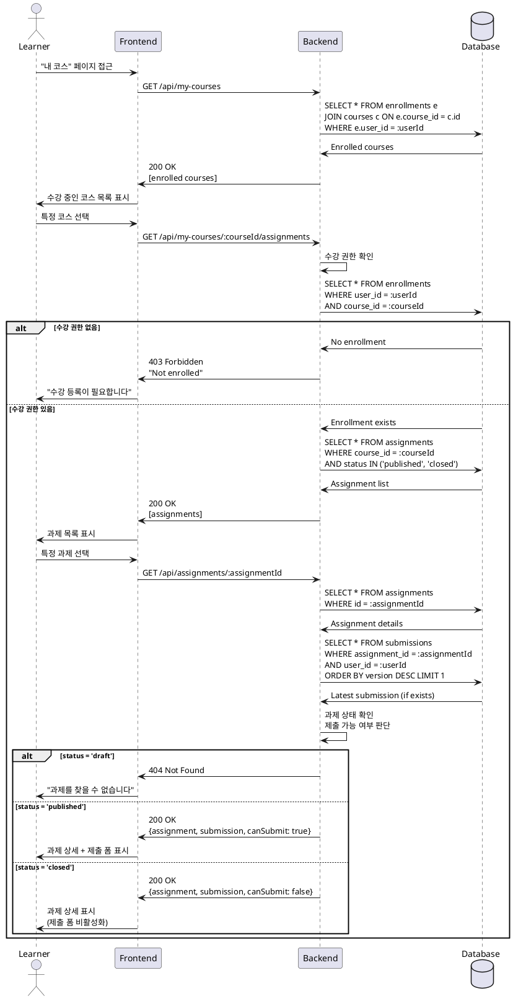

# 과제 상세 열람 유스케이스

## Primary Actor
학습자 (Learner 역할)

## Precondition
- 학습자가 로그인 상태임
- 해당 코스에 수강 등록되어 있음
- 과제가 published 상태임

## Trigger
학습자가 내 코스 목록에서 특정 과제를 선택

## Main Scenario
1. 학습자가 "내 코스" 페이지에 접근함
2. 학습자가 수강 중인 코스를 선택함
3. 시스템이 해당 코스의 과제 목록을 표시함
4. 학습자가 특정 과제를 선택함
5. 시스템이 수강 권한을 확인함
6. 시스템이 과제 상태를 확인함 (published/closed)
7. 시스템이 과제 상세 정보를 표시함
   - 과제 제목 및 설명
   - 마감일 및 남은 시간
   - 점수 비중
   - 지각 제출 허용 여부
   - 재제출 허용 여부
8. 시스템이 현재 제출 상태를 표시함
   - 미제출/제출됨/채점완료/재제출요청
9. 시스템이 과제 상태에 따라 제출 UI를 조정함
   - published: 제출 폼 활성화
   - closed: 제출 폼 비활성화, "마감됨" 표시

## Edge Cases
- **E1: 미수강 코스의 과제 접근**
  - 시스템이 403 Forbidden 에러 반환
  - "수강 등록이 필요합니다" 메시지 표시
- **E2: Draft 상태 과제 접근**
  - 시스템이 404 Not Found 반환
  - "과제를 찾을 수 없습니다" 메시지 표시
- **E3: 마감된 과제 접근**
  - 과제 정보는 표시하되 제출 불가능
  - "마감된 과제입니다" 안내 표시
- **E4: 삭제된 과제 접근**
  - 시스템이 404 에러 반환

## Business Rules
- published 상태의 과제만 학습자에게 표시
- 수강 등록된 학습자만 과제 상세 접근 가능
- closed 상태 과제는 열람만 가능, 제출 불가
- 마감 시간은 클라이언트 타임존으로 표시

## Sequence Diagram

