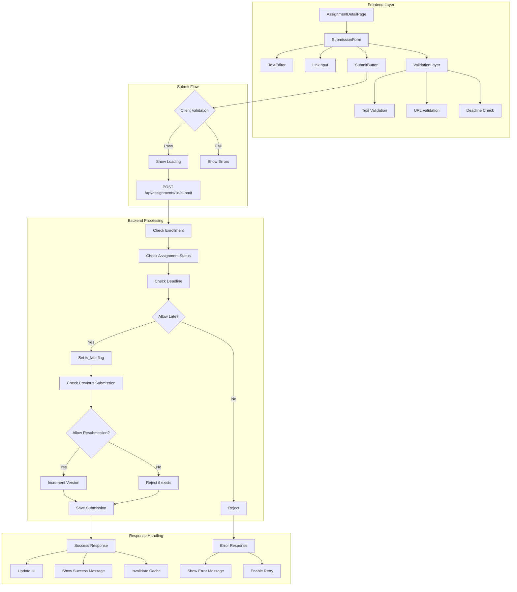

# 과제 제출 모듈화 설계

## 개요

### 모듈 목록

| 모듈 이름 | 위치 | 설명 |
|----------|------|------|
| **Submission Feature** | `src/features/submission/` | 과제 제출 핵심 비즈니스 로직 |
| **Submission Form** | `src/components/submission/form/` | 제출 폼 컴포넌트 |
| **File Upload** | `src/components/upload/` | 파일 업로드 컴포넌트 (향후 확장) |
| **URL Validator** | `src/lib/validators/url.ts` | URL 형식 검증 유틸리티 |
| **Deadline Checker** | `src/lib/utils/deadline.ts` | 마감일 검증 유틸리티 |
| **Version Manager** | `src/lib/utils/version.ts` | 제출 버전 관리 유틸리티 |

## Diagram



## Implementation Plan

### 1. Backend Modules

#### 1.1 Submission Feature Backend (`src/features/submission/backend/`)

**route.ts**
- `POST /api/assignments/:id/submit` - 과제 제출
- `GET /api/assignments/:id/submissions` - 제출 이력 조회
- `PUT /api/submissions/:id` - 제출물 수정 (재제출)

**service.ts**
- `submitAssignment()` - 과제 제출 처리
- `validateSubmission()` - 제출 가능 여부 검증
- `checkDeadline()` - 마감일 확인 및 지각 판단
- `getLatestSubmission()` - 최신 제출물 조회
- `calculateNextVersion()` - 다음 버전 번호 계산
- `createSubmission()` - 제출물 생성

**schema.ts**
```typescript
// 제출 요청 스키마
export const SubmitAssignmentSchema = z.object({
  content_text: z.string().min(1, '답변을 입력해주세요').max(10000),
  content_link: z.string().url('올바른 URL 형식이 아닙니다').optional(),
});

// 제출 응답 스키마
export const SubmissionResponseSchema = z.object({
  id: z.string().uuid(),
  version: z.number(),
  is_late: z.boolean(),
  status: z.enum(['submitted', 'graded', 'resubmission_required']),
  submitted_at: z.string().datetime(),
});
```

**error.ts**
- `SUBMISSION_NOT_ALLOWED` - 제출 불가 상태
- `DEADLINE_PASSED` - 마감일 초과
- `ALREADY_SUBMITTED` - 이미 제출됨 (재제출 불가)
- `ASSIGNMENT_CLOSED` - 과제 마감됨
- `CONTENT_REQUIRED` - 필수 내용 누락

**Unit Tests**
```typescript
describe('SubmissionService', () => {
  it('should accept submission before deadline');
  it('should mark late submission correctly');
  it('should block submission after deadline when late not allowed');
  it('should increment version on resubmission');
  it('should block resubmission when not allowed');
  it('should validate content requirements');
  it('should handle concurrent submissions gracefully');
});
```

### 2. Frontend Modules

#### 2.1 Submission Form Component (`src/components/submission/form/SubmissionForm.tsx`)

**주요 기능**
- 텍스트 에디터 (마크다운 지원 옵션)
- URL 입력 필드
- 실시간 유효성 검사
- 자동 저장 (로컬스토리지)
- 제출 전 확인 다이얼로그

**Props**
```typescript
interface SubmissionFormProps {
  assignmentId: string;
  deadline: Date;
  allowLate: boolean;
  allowResubmission: boolean;
  previousSubmission?: Submission;
  onSubmit: (data: SubmissionData) => Promise<void>;
  onCancel: () => void;
}
```

**QA Sheet**
- [ ] 텍스트 필드 비어있을 때 제출 차단
- [ ] URL 형식 실시간 검증 동작
- [ ] 마감 시간 지난 후 폼 비활성화 (late 불허 시)
- [ ] 지각 제출 시 경고 메시지 표시
- [ ] 재제출 시 이전 내용 표시
- [ ] 제출 중 이중 클릭 방지
- [ ] 제출 성공 후 폼 초기화
- [ ] 네트워크 오류 시 재시도 옵션
- [ ] 자동 저장 내용 복구 기능

#### 2.2 Submit Page (`src/app/my-courses/[courseId]/assignments/[assignmentId]/submit/page.tsx`)

**주요 기능**
- 과제 정보 요약 표시
- 제출 폼 렌더링
- 제출 상태 관리
- 성공/실패 처리

**QA Sheet**
- [ ] 이미 제출한 경우 이전 내용 표시
- [ ] 재제출 불가 시 읽기 전용 모드
- [ ] 제출 성공 시 피드백 페이지로 리다이렉트
- [ ] 제출 실패 시 에러 메시지 표시
- [ ] 마감된 과제 접근 시 적절한 안내

### 3. Shared Modules

#### 3.1 Deadline Utilities (`src/lib/utils/deadline.ts`)

```typescript
export function isBeforeDeadline(deadline: Date): boolean {
  return new Date() < deadline;
}

export function calculateLateStatus(
  deadline: Date,
  allowLate: boolean
): { canSubmit: boolean; isLate: boolean; message?: string } {
  const now = new Date();

  if (now < deadline) {
    return { canSubmit: true, isLate: false };
  }

  if (allowLate) {
    return {
      canSubmit: true,
      isLate: true,
      message: '지각 제출입니다. 점수가 감점될 수 있습니다.'
    };
  }

  return {
    canSubmit: false,
    isLate: true,
    message: '마감일이 지났습니다.'
  };
}
```

#### 3.2 URL Validator (`src/lib/validators/url.ts`)

```typescript
export const urlValidator = z
  .string()
  .optional()
  .refine(
    (val) => !val || isValidUrl(val),
    { message: '올바른 URL 형식을 입력해주세요' }
  );

function isValidUrl(url: string): boolean {
  try {
    const parsed = new URL(url);
    return ['http:', 'https:'].includes(parsed.protocol);
  } catch {
    return false;
  }
}
```

### 4. State Management

#### 4.1 Submission Mutation Hook (`src/features/submission/hooks/useSubmitAssignment.ts`)

```typescript
export function useSubmitAssignment(assignmentId: string) {
  const queryClient = useQueryClient();
  const router = useRouter();

  return useMutation({
    mutationFn: (data: SubmissionData) =>
      submitAssignment(assignmentId, data),

    onMutate: async (data) => {
      // Optimistic update
      await queryClient.cancelQueries(['submission-status', assignmentId]);
      const previousStatus = queryClient.getQueryData(['submission-status', assignmentId]);

      queryClient.setQueryData(['submission-status', assignmentId], {
        status: 'submitted',
        ...data,
      });

      return { previousStatus };
    },

    onError: (err, data, context) => {
      // Rollback on error
      if (context?.previousStatus) {
        queryClient.setQueryData(
          ['submission-status', assignmentId],
          context.previousStatus
        );
      }
    },

    onSuccess: (response) => {
      // Invalidate and redirect
      queryClient.invalidateQueries(['submission-status', assignmentId]);
      queryClient.invalidateQueries(['assignments']);

      if (response.is_late) {
        toast.warning('지각 제출되었습니다');
      } else {
        toast.success('제출이 완료되었습니다');
      }

      router.push(`/my-courses/.../assignments/${assignmentId}/feedback`);
    },
  });
}
```

#### 4.2 Form State Management (`src/features/submission/hooks/useSubmissionForm.ts`)

```typescript
export function useSubmissionForm(assignmentId: string) {
  const [isDirty, setIsDirty] = useState(false);
  const [autoSaveEnabled, setAutoSaveEnabled] = useState(true);

  const form = useForm<SubmissionFormData>({
    resolver: zodResolver(SubmitAssignmentSchema),
    defaultValues: {
      content_text: '',
      content_link: '',
    },
  });

  // Auto-save to localStorage
  useEffect(() => {
    if (isDirty && autoSaveEnabled) {
      const timeoutId = setTimeout(() => {
        localStorage.setItem(
          `draft-${assignmentId}`,
          JSON.stringify(form.getValues())
        );
      }, 1000);

      return () => clearTimeout(timeoutId);
    }
  }, [form.watch(), isDirty, autoSaveEnabled]);

  // Load draft on mount
  useEffect(() => {
    const draft = localStorage.getItem(`draft-${assignmentId}`);
    if (draft) {
      const parsed = JSON.parse(draft);
      form.reset(parsed);
    }
  }, [assignmentId]);

  return {
    form,
    isDirty,
    clearDraft: () => localStorage.removeItem(`draft-${assignmentId}`),
  };
}
```

### 5. UI/UX Considerations

#### 5.1 Submission Confirmation Dialog

```typescript
interface ConfirmDialogProps {
  isLate: boolean;
  onConfirm: () => void;
  onCancel: () => void;
}

export function SubmitConfirmDialog({ isLate, onConfirm, onCancel }: ConfirmDialogProps) {
  return (
    <Dialog>
      <DialogHeader>과제를 제출하시겠습니까?</DialogHeader>
      <DialogContent>
        {isLate && (
          <Alert variant="warning">
            현재 마감 시간이 지났습니다. 지각 제출로 처리됩니다.
          </Alert>
        )}
        <p>제출 후에는 수정이 {allowResubmission ? '가능' : '불가능'}합니다.</p>
      </DialogContent>
      <DialogActions>
        <Button variant="ghost" onClick={onCancel}>취소</Button>
        <Button variant="primary" onClick={onConfirm}>제출</Button>
      </DialogActions>
    </Dialog>
  );
}
```

### 6. Error Recovery

1. **Network failure** - 로컬 저장 후 재시도
2. **Server error** - 에러 메시지와 함께 폼 유지
3. **Validation error** - 필드별 에러 표시
4. **Concurrent submission** - 중복 제출 방지
5. **Session timeout** - 재인증 후 제출 재시도

### 7. Performance Optimizations

1. **Debounced validation** - 입력 중 과도한 검증 방지
2. **Lazy validation** - 포커스 아웃 시 검증
3. **Optimistic UI** - 제출 즉시 성공 상태 표시
4. **Request queue** - 네트워크 복구 시 자동 재시도

### 8. Testing Strategy

#### 8.1 E2E Tests
- 정상 제출 플로우
- 지각 제출 플로우
- 재제출 플로우
- 에러 복구 시나리오

#### 8.2 Integration Tests
- API 엔드포인트 테스트
- 데이터베이스 트랜잭션 테스트
- 동시성 제어 테스트