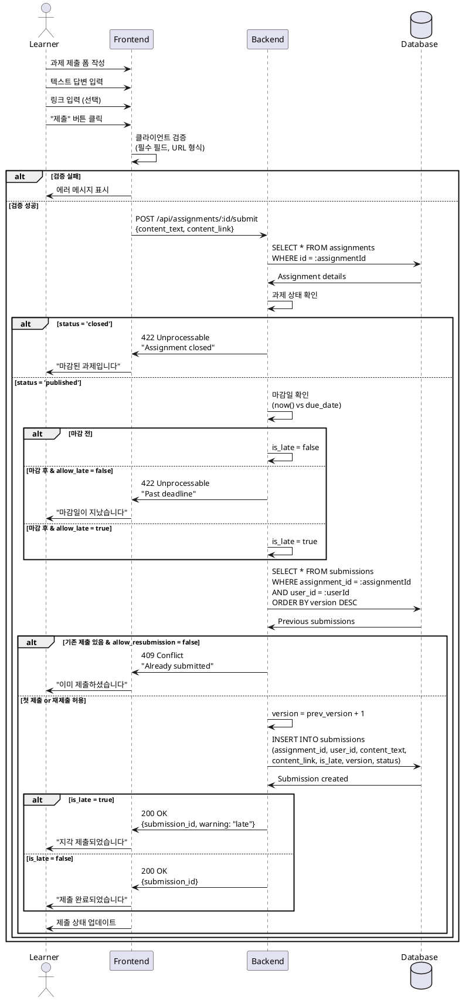

# 과제 제출 유스케이스

## Primary Actor
학습자 (Learner 역할)

## Precondition
- 학습자가 로그인 상태임
- 해당 코스에 수강 등록되어 있음
- 과제가 published 상태임
- 과제 상세 페이지에 접근함

## Trigger
학습자가 과제 제출 버튼을 클릭

## Main Scenario
1. 학습자가 과제 상세 페이지에서 제출 폼을 확인함
2. 학습자가 텍스트 답변을 입력함 (필수)
3. 학습자가 참고 링크를 입력함 (선택)
4. 학습자가 "제출" 버튼을 클릭함
5. 시스템이 입력값을 검증함
   - 텍스트 필드 비어있지 않은지 확인
   - 링크 형식이 올바른지 확인 (입력한 경우)
6. 시스템이 마감일을 확인함
7. 시스템이 기존 제출 여부를 확인함
8. 시스템이 제출물을 저장함
   - 정상 제출 또는 지각 제출 플래그 설정
9. 시스템이 제출 완료 메시지를 표시함
10. 학습자가 제출 상태 변경을 확인함

## Edge Cases
- **E1: 필수 텍스트 필드 누락**
  - 시스템이 "답변을 입력해주세요" 에러 메시지 표시
- **E2: 잘못된 URL 형식**
  - 시스템이 "올바른 URL 형식을 입력해주세요" 에러 표시
- **E3: 마감일 이후 제출 (지각 불허)**
  - 시스템이 제출 차단
  - "마감일이 지났습니다" 메시지 표시
- **E4: 마감일 이후 제출 (지각 허용)**
  - 시스템이 지각 제출로 처리
  - "지각 제출되었습니다" 경고 메시지 표시
- **E5: 재제출 시도 (재제출 불허)**
  - 시스템이 제출 차단
  - "이미 제출하셨습니다" 메시지 표시
- **E6: 재제출 시도 (재제출 허용)**
  - 시스템이 새 버전으로 저장
  - "재제출되었습니다" 메시지 표시
- **E7: Closed 상태 과제 제출 시도**
  - 시스템이 제출 차단
  - "마감된 과제입니다" 메시지 표시

## Business Rules
- 텍스트 답변은 필수 입력
- 링크는 선택 입력, 입력 시 URL 형식 검증
- 마감일 이후 제출:
  - allow_late=true: 지각 제출 허용, is_late=true 플래그
  - allow_late=false: 제출 차단
- 재제출 정책:
  - allow_resubmission=true: 새 버전 생성 (version++)
  - allow_resubmission=false: 최초 1회만 제출 가능
- status='closed' 과제는 모든 제출 차단

## Sequence Diagram

