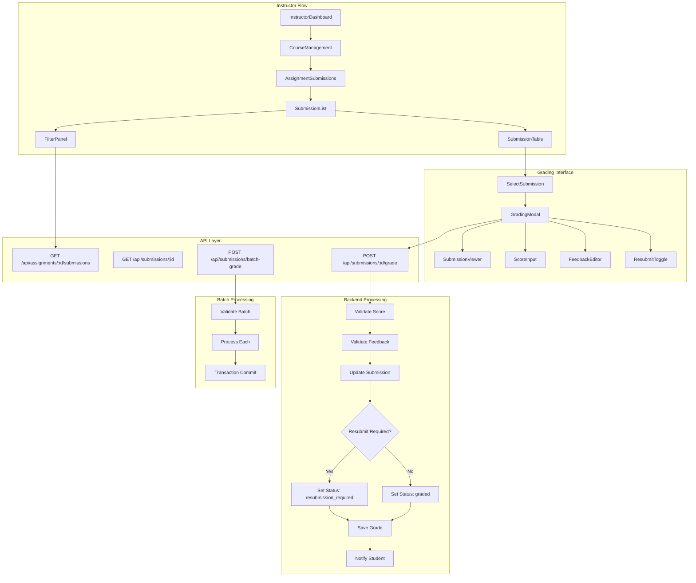

# 과제 채점 & 피드백 모듈화 설계

## 개요

### 모듈 목록

| 모듈 이름 | 위치 | 설명 |
|----------|------|------|
| **Grading Feature** | `src/features/grading/` | 채점 및 피드백 핵심 로직 |
| **Submission Review** | `src/components/grading/review/` | 제출물 검토 UI |
| **Score Input** | `src/components/grading/score/` | 점수 입력 컴포넌트 |
| **Feedback Editor** | `src/components/grading/feedback/` | 피드백 에디터 |
| **Batch Actions** | `src/components/grading/batch/` | 일괄 처리 도구 |
| **Grading Queue** | `src/lib/utils/grading-queue.ts` | 채점 대기열 관리 |

## Diagram



## Implementation Plan

### 1. Backend Modules

#### 1.1 Grading Feature Backend (`src/features/grading/backend/`)

**route.ts**
- `GET /api/assignments/:id/submissions` - 제출물 목록 조회
- `GET /api/submissions/:id` - 제출물 상세 조회
- `POST /api/submissions/:id/grade` - 채점 처리
- `POST /api/submissions/batch-grade` - 일괄 채점
- `GET /api/instructor/grading-queue` - 채점 대기열

**service.ts**
- `getSubmissionsForGrading()` - 채점용 제출물 목록
- `gradeSubmission()` - 개별 채점 처리
- `batchGradeSubmissions()` - 일괄 채점
- `validateGradingPermission()` - 채점 권한 확인
- `calculateGradingStats()` - 채점 통계 계산
- `getNextUngradedSubmission()` - 다음 미채점 제출물

**schema.ts**
```typescript
export const GradeSubmissionSchema = z.object({
  score: z.number().min(0).max(100),
  feedback: z.string().min(1, '피드백을 입력해주세요').max(5000),
  request_resubmission: z.boolean().optional(),
});

export const BatchGradeSchema = z.object({
  submissions: z.array(z.object({
    id: z.string().uuid(),
    score: z.number().min(0).max(100),
    feedback: z.string(),
  })),
});

export const GradingFilterSchema = z.object({
  status: z.enum(['all', 'ungraded', 'graded', 'late']).optional(),
  sortBy: z.enum(['submitted_at', 'name', 'status']).optional(),
});
```

**error.ts**
- `GRADING_PERMISSION_DENIED`
- `INVALID_SCORE_RANGE`
- `FEEDBACK_REQUIRED`
- `SUBMISSION_NOT_FOUND`
- `ALREADY_GRADED`

**Unit Tests**
```typescript
describe('GradingService', () => {
  it('should only allow instructor to grade their course submissions');
  it('should validate score range 0-100');
  it('should require feedback text');
  it('should update submission status correctly');
  it('should handle batch grading atomically');
  it('should calculate statistics accurately');
});
```

### 2. Frontend Modules

#### 2.1 Submissions Page (`src/app/manage/courses/[courseId]/assignments/[assignmentId]/submissions/page.tsx`)

**주요 기능**
- 제출물 목록 테이블
- 필터링 (미채점/채점완료/지각)
- 정렬 옵션
- 일괄 선택 및 처리
- 채점 모달 열기

**QA Sheet**
- [ ] 제출물 목록 정확히 표시
- [ ] 필터 적용 시 즉시 반영
- [ ] 채점 상태별 색상 구분
- [ ] 지각 제출 표시 확인
- [ ] 일괄 선택 기능 동작
- [ ] 페이지네이션 동작 확인
- [ ] 빈 제출물 목록 안내 메시지

#### 2.2 Grading Modal (`src/components/grading/GradingModal.tsx`)

**Props**
```typescript
interface GradingModalProps {
  submission: Submission;
  assignment: Assignment;
  onGrade: (data: GradeData) => Promise<void>;
  onNext?: () => void;
  onPrevious?: () => void;
  onClose: () => void;
}
```

**QA Sheet**
- [ ] 제출 내용 정확히 표시
- [ ] 점수 입력 범위 검증
- [ ] 피드백 필수 입력 확인
- [ ] 재제출 요청 토글 동작
- [ ] 채점 완료 후 다음 제출물 이동
- [ ] 저장 중 로딩 상태 표시
- [ ] 에러 발생 시 메시지 표시

#### 2.3 Score Input Component (`src/components/grading/score/ScoreInput.tsx`)

**Features**
- 숫자 입력 제한 (0-100)
- 슬라이더 옵션
- 점수 등급 표시 (A/B/C/D/F)
- 빠른 점수 버튼 (100, 90, 80, 70, 60)

### 3. Shared Components

#### 3.1 Submission Table (`src/components/grading/table/SubmissionTable.tsx`)

**Columns**
- 학생 이름
- 제출 시간
- 지각 여부
- 점수
- 채점 상태
- 액션 버튼

**Features**
- 정렬 가능한 헤더
- 행 선택 체크박스
- 상태별 행 색상
- 호버 효과

#### 3.2 Feedback Editor (`src/components/grading/feedback/FeedbackEditor.tsx`)

**Features**
- 리치 텍스트 에디터
- 마크다운 지원
- 자주 사용하는 피드백 템플릿
- 문자 수 표시
- 자동 저장

### 4. State Management

#### 4.1 React Query Hooks

```typescript
// useSubmissionsQuery.ts
export function useSubmissionsQuery(
  assignmentId: string,
  filters: GradingFilters
) {
  return useQuery({
    queryKey: ['submissions', assignmentId, filters],
    queryFn: () => fetchSubmissions(assignmentId, filters),
    keepPreviousData: true,
  });
}

// useGradeMutation.ts
export function useGradeMutation() {
  const queryClient = useQueryClient();

  return useMutation({
    mutationFn: gradeSubmission,
    onSuccess: (data, variables) => {
      queryClient.invalidateQueries(['submissions']);
      queryClient.invalidateQueries(['grading-stats']);

      toast.success('채점이 완료되었습니다');
    },
    onError: (error) => {
      toast.error('채점 중 오류가 발생했습니다');
    },
  });
}
```

#### 4.2 Grading Store (`src/features/grading/store.ts`)

```typescript
interface GradingStore {
  currentSubmissionId: string | null;
  gradingQueue: string[];
  filters: GradingFilters;
  selectedSubmissions: Set<string>;

  setCurrentSubmission: (id: string | null) => void;
  setFilters: (filters: GradingFilters) => void;
  toggleSelection: (id: string) => void;
  selectAll: () => void;
  clearSelection: () => void;
  moveToNext: () => void;
  moveToPrevious: () => void;
}
```

### 5. Advanced Features

#### 5.1 Grading Templates (`src/features/grading/lib/templates.ts`)

```typescript
export const feedbackTemplates = {
  excellent: '훌륭한 과제입니다! 모든 요구사항을 충족했습니다.',
  good: '좋은 시도입니다. 다음 부분을 개선하면 더 좋을 것 같습니다:',
  needsWork: '기본 요구사항은 충족했으나 다음 부분이 부족합니다:',
  incomplete: '제출이 불완전합니다. 다음 부분을 보완해주세요:',
};
```

#### 5.2 Batch Operations (`src/features/grading/lib/batch.ts`)

```typescript
export async function batchGrade(
  submissions: string[],
  baseScore: number,
  baseFeedback: string
) {
  const operations = submissions.map(id => ({
    id,
    score: baseScore,
    feedback: baseFeedback,
  }));

  return apiClient.post('/api/submissions/batch-grade', {
    operations,
  });
}
```

### 6. Analytics & Insights

#### 6.1 Grading Statistics Component

```typescript
interface GradingStatsProps {
  assignmentId: string;
}

export function GradingStats({ assignmentId }: GradingStatsProps) {
  const { data: stats } = useGradingStats(assignmentId);

  return (
    <StatsGrid>
      <StatCard label="평균 점수" value={stats.averageScore} />
      <StatCard label="제출률" value={`${stats.submissionRate}%`} />
      <StatCard label="미채점" value={stats.ungradedCount} />
      <StatCard label="지각 제출" value={stats.lateCount} />
    </StatsGrid>
  );
}
```

### 7. Keyboard Shortcuts

```typescript
const shortcuts = {
  'cmd+enter': 'submitGrade',
  'cmd+]': 'nextSubmission',
  'cmd+[': 'previousSubmission',
  'esc': 'closeModal',
  '1-5': 'quickScore', // 20, 40, 60, 80, 100
};
```

### 8. Export Features

#### 8.1 Grade Export

```typescript
export async function exportGrades(assignmentId: string, format: 'csv' | 'xlsx') {
  const submissions = await fetchAllSubmissions(assignmentId);
  const formatted = formatForExport(submissions);

  if (format === 'csv') {
    downloadCSV(formatted, `grades-${assignmentId}.csv`);
  } else {
    downloadExcel(formatted, `grades-${assignmentId}.xlsx`);
  }
}
```

### 9. Performance Optimizations

1. **Virtual scrolling** - 대량 제출물 목록
2. **Lazy loading** - 제출물 내용 지연 로딩
3. **Optimistic updates** - 채점 즉시 UI 업데이트
4. **Request batching** - 여러 채점 요청 묶음 처리
5. **Cache warming** - 다음 제출물 미리 로드

### 10. Testing Strategy

#### 10.1 Integration Tests
```typescript
describe('Grading Flow', () => {
  it('should complete full grading workflow');
  it('should handle concurrent grading attempts');
  it('should rollback on batch failure');
  it('should maintain data consistency');
});
```

#### 10.2 E2E Tests
- 단일 제출물 채점
- 일괄 채점
- 재제출 요청
- 필터링 및 정렬
- 키보드 네비게이션