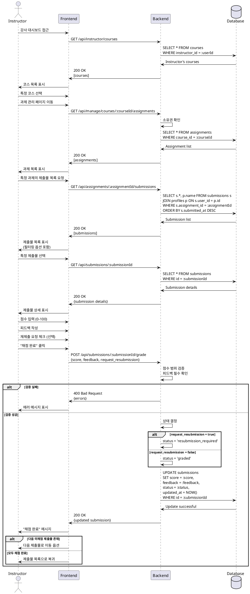

# 과제 채점 & 피드백 유스케이스

## Primary Actor
강사 (Instructor 역할)

## Precondition
- 강사가 로그인 상태임
- 해당 코스의 소유자임
- 과제에 제출물이 존재함
- 과제가 published 또는 closed 상태임

## Trigger
강사가 제출물 목록에서 특정 제출물의 채점을 시작

## Main Scenario
1. 강사가 강사 대시보드에 접근함
2. 강사가 본인 코스 목록을 확인함
3. 강사가 특정 코스의 과제 관리 페이지로 이동함
4. 강사가 특정 과제의 제출물 목록을 확인함
   - 필터: 미채점/채점완료/지각/재제출요청
5. 강사가 채점할 제출물을 선택함
6. 시스템이 제출물 상세 내용을 표시함
   - 학습자 정보
   - 제출 시간, 지각 여부
   - 제출 내용 (텍스트, 링크)
   - 버전 정보
7. 강사가 점수를 입력함 (0-100)
8. 강사가 피드백 텍스트를 작성함
9. 강사가 재제출 요청 여부를 선택함 (선택)
10. 강사가 "채점 완료" 버튼을 클릭함
11. 시스템이 채점 정보를 저장함
12. 시스템이 제출물 상태를 업데이트함
13. 시스템이 다음 미채점 제출물로 이동함 (선택)

## Edge Cases
- **E1: 타인 코스 접근 시도**
  - 시스템이 403 Forbidden 반환
  - "권한이 없습니다" 메시지 표시
- **E2: 점수 범위 초과**
  - 시스템이 0-100 범위 검증
  - "점수는 0-100 사이여야 합니다" 에러 표시
- **E3: 피드백 미입력**
  - 시스템이 경고 메시지 표시
  - "피드백을 입력해주세요" (필수)
- **E4: 이미 채점된 제출물 재채점**
  - 기존 점수/피드백 덮어쓰기
  - 수정 이력 저장 (updated_at)
- **E5: Draft 상태 과제의 제출물 채점**
  - 시스템이 채점 차단
  - "과제를 먼저 게시해주세요" 메시지

## Business Rules
- 본인 소유 코스의 과제만 채점 가능
- 점수는 0-100 정수값
- 피드백은 필수 입력
- 재제출 요청 시 상태를 resubmission_required로 변경
- 채점 완료 시 상태를 graded로 변경
- 채점 후에도 수정 가능

## Sequence Diagram

