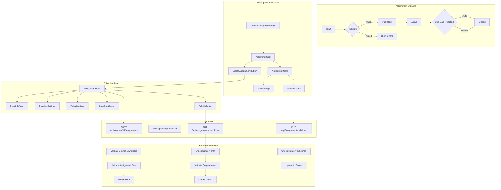

# Assignment 게시/마감 모듈화 설계

## 개요

### 모듈 목록

| 모듈 이름 | 위치 | 설명 |
|----------|------|------|
| **Assignment Management** | `src/features/assignment-management/` | 과제 관리 핵심 로직 |
| **Assignment Editor** | `src/components/assignment/editor/` | 과제 생성/수정 에디터 |
| **Status Control** | `src/components/assignment/status/` | 상태 전환 컨트롤 |
| **Date Picker** | `src/components/ui/date-picker/` | 날짜/시간 선택기 |
| **Policy Settings** | `src/components/assignment/policy/` | 정책 설정 컴포넌트 |
| **State Machine** | `src/lib/state/assignment.ts` | 과제 상태 머신 |

## Diagram



## Implementation Plan

### 1. Backend Modules

#### 1.1 Assignment Management Backend (`src/features/assignment-management/backend/`)

**route.ts**
- `POST /api/courses/:courseId/assignments` - 과제 생성
- `PUT /api/assignments/:id` - 과제 수정
- `PUT /api/assignments/:id/publish` - 과제 게시
- `PUT /api/assignments/:id/close` - 과제 마감
- `DELETE /api/assignments/:id` - 과제 삭제

**service.ts**
- `createAssignment()` - 과제 생성 (draft 상태)
- `updateAssignment()` - 과제 정보 수정
- `publishAssignment()` - draft → published 전환
- `closeAssignment()` - published → closed 전환
- `validateAssignmentData()` - 데이터 유효성 검증
- `checkDeletePermission()` - 삭제 가능 여부 확인
- `autoCloseExpiredAssignments()` - 만료 과제 자동 마감

**schema.ts**
```typescript
export const CreateAssignmentSchema = z.object({
  title: z.string().min(1).max(200),
  description: z.string().optional(),
  due_date: z.string().datetime(),
  weight: z.number().min(0).max(100).default(0),
  allow_late: z.boolean().default(false),
  allow_resubmission: z.boolean().default(false),
});

export const UpdateAssignmentSchema = CreateAssignmentSchema.partial();

export const PublishValidationSchema = z.object({
  title: z.string().min(1),
  due_date: z.string().datetime().refine(
    (date) => new Date(date) > new Date(),
    '마감일은 현재 시간 이후여야 합니다'
  ),
});
```

**error.ts**
- `INVALID_DUE_DATE` - 과거 날짜 설정
- `CANNOT_MODIFY_PUBLISHED` - 게시된 과제 수정 제한
- `CANNOT_DELETE_WITH_SUBMISSIONS` - 제출물 있는 과제 삭제 불가
- `INVALID_STATUS_TRANSITION` - 잘못된 상태 전환
- `COURSE_NOT_PUBLISHED` - 미게시 코스의 과제 게시 불가

**Unit Tests**
```typescript
describe('AssignmentManagementService', () => {
  it('should create assignment in draft status');
  it('should prevent publishing with past due date');
  it('should prevent status rollback');
  it('should auto-close expired assignments');
  it('should prevent deletion with submissions');
  it('should validate weight range');
});
```

### 2. Frontend Modules

#### 2.1 Assignment Editor Page (`src/app/manage/courses/[courseId]/assignments/new/page.tsx`)

**주요 기능**
- 단계별 과제 생성 폼
- 실시간 유효성 검사
- 자동 저장 (draft)
- 미리보기 기능

**QA Sheet**
- [ ] 필수 필드 검증 동작
- [ ] 마감일 미래 시간 검증
- [ ] 점수 비중 0-100 범위 검증
- [ ] Draft 저장 기능 동작
- [ ] 게시 전 검증 확인
- [ ] 취소 시 확인 다이얼로그

#### 2.2 Assignment Management Component (`src/components/assignment/management/AssignmentManagement.tsx`)

**Features**
- 과제 목록 그리드/리스트 뷰
- 상태별 필터링
- 일괄 상태 변경
- 드래그앤드롭 순서 변경

**QA Sheet**
- [ ] Draft 과제 게시 버튼 동작
- [ ] Published 과제 마감 버튼 동작
- [ ] Closed 과제 수정 불가 확인
- [ ] 상태 전환 시 확인 메시지
- [ ] 상태별 액션 버튼 표시

#### 2.3 Assignment Form Component (`src/components/assignment/editor/AssignmentForm.tsx`)

**Sections**
1. **기본 정보**
   - 제목 (필수)
   - 설명 (선택)

2. **마감 설정**
   - 마감일시 (필수)
   - 시간대 선택
   - 지각 제출 허용

3. **평가 설정**
   - 점수 비중
   - 재제출 허용
   - 채점 기준

**Props**
```typescript
interface AssignmentFormProps {
  courseId: string;
  assignment?: Assignment;
  mode: 'create' | 'edit';
  onSave: (data: AssignmentData) => Promise<void>;
  onPublish: (data: AssignmentData) => Promise<void>;
  onCancel: () => void;
}
```

### 3. State Management

#### 3.1 Assignment State Machine (`src/lib/state/assignment-state.ts`)

```typescript
type AssignmentState = 'draft' | 'published' | 'closed';

interface StateTransition {
  from: AssignmentState;
  to: AssignmentState;
  action: string;
  guard?: (assignment: Assignment) => boolean;
}

const transitions: StateTransition[] = [
  {
    from: 'draft',
    to: 'published',
    action: 'PUBLISH',
    guard: (assignment) => {
      return assignment.due_date > new Date() &&
             assignment.title.length > 0;
    },
  },
  {
    from: 'published',
    to: 'closed',
    action: 'CLOSE',
  },
];

export function canTransition(
  assignment: Assignment,
  targetState: AssignmentState
): boolean {
  const transition = transitions.find(
    t => t.from === assignment.status && t.to === targetState
  );

  if (!transition) return false;
  if (transition.guard) return transition.guard(assignment);
  return true;
}
```

#### 3.2 Assignment Mutations (`src/features/assignment-management/hooks/`)

```typescript
// useCreateAssignment.ts
export function useCreateAssignment() {
  const queryClient = useQueryClient();
  const router = useRouter();

  return useMutation({
    mutationFn: createAssignment,
    onSuccess: (data) => {
      queryClient.invalidateQueries(['assignments']);
      toast.success('과제가 생성되었습니다');
      router.push(`/manage/courses/${data.course_id}/assignments`);
    },
  });
}

// usePublishAssignment.ts
export function usePublishAssignment() {
  return useMutation({
    mutationFn: publishAssignment,
    onMutate: async ({ id }) => {
      // Optimistic update
      await queryClient.cancelQueries(['assignment', id]);
      const previous = queryClient.getQueryData(['assignment', id]);

      queryClient.setQueryData(['assignment', id], old => ({
        ...old,
        status: 'published',
      }));

      return { previous };
    },
    onError: (err, variables, context) => {
      // Rollback
      if (context?.previous) {
        queryClient.setQueryData(
          ['assignment', variables.id],
          context.previous
        );
      }
    },
    onSuccess: () => {
      toast.success('과제가 게시되었습니다');
    },
  });
}
```

### 4. UI Components

#### 4.1 Status Control Panel (`src/components/assignment/status/StatusControl.tsx`)

```typescript
interface StatusControlProps {
  assignment: Assignment;
  onPublish: () => void;
  onClose: () => void;
  onDelete: () => void;
}

export function StatusControl({
  assignment,
  onPublish,
  onClose,
  onDelete,
}: StatusControlProps) {
  const canPublish = canTransition(assignment, 'published');
  const canClose = canTransition(assignment, 'closed');
  const canDelete = assignment.status === 'draft' && !assignment.submissions_count;

  return (
    <ControlPanel>
      <StatusBadge status={assignment.status} />

      {assignment.status === 'draft' && (
        <Button
          onClick={onPublish}
          disabled={!canPublish}
          variant="primary"
        >
          게시하기
        </Button>
      )}

      {assignment.status === 'published' && (
        <Button
          onClick={onClose}
          disabled={!canClose}
          variant="secondary"
        >
          마감하기
        </Button>
      )}

      {canDelete && (
        <Button
          onClick={onDelete}
          variant="danger"
        >
          삭제
        </Button>
      )}
    </ControlPanel>
  );
}
```

#### 4.2 Deadline Picker (`src/components/ui/date-picker/DeadlinePicker.tsx`)

**Features**
- 날짜 & 시간 통합 선택
- 시간대 설정
- 빠른 선택 (1일 후, 1주 후, 2주 후)
- 최소 날짜 검증

### 5. Automation & Scheduling

#### 5.1 Auto-close Scheduler (`src/features/assignment-management/lib/scheduler.ts`)

```typescript
// Cron job or scheduled function
export async function autoCloseExpiredAssignments() {
  const supabase = createServiceClient();

  const { data: assignments } = await supabase
    .from('assignments')
    .select('*')
    .eq('status', 'published')
    .lt('due_date', new Date().toISOString());

  for (const assignment of assignments) {
    await supabase
      .from('assignments')
      .update({ status: 'closed', updated_at: new Date() })
      .eq('id', assignment.id);

    console.log(`Auto-closed assignment: ${assignment.id}`);
  }
}
```

### 6. Validation Rules

#### 6.1 Business Rules Validator

```typescript
export const assignmentBusinessRules = {
  canPublish: (assignment: Assignment): ValidationResult => {
    const errors = [];

    if (!assignment.title) {
      errors.push('제목은 필수입니다');
    }

    if (new Date(assignment.due_date) <= new Date()) {
      errors.push('마감일은 현재 시간 이후여야 합니다');
    }

    if (assignment.weight < 0 || assignment.weight > 100) {
      errors.push('점수 비중은 0-100 사이여야 합니다');
    }

    return {
      valid: errors.length === 0,
      errors,
    };
  },

  canModify: (assignment: Assignment): boolean => {
    return assignment.status === 'draft' ||
           (assignment.status === 'published' && !assignment.has_submissions);
  },

  canDelete: (assignment: Assignment): boolean => {
    return assignment.status === 'draft' && !assignment.has_submissions;
  },
};
```

### 7. Notifications

#### 7.1 Status Change Notifications

```typescript
export async function notifyAssignmentPublished(assignment: Assignment) {
  const enrolledStudents = await getEnrolledStudents(assignment.course_id);

  for (const student of enrolledStudents) {
    await sendNotification({
      user_id: student.id,
      type: 'assignment_published',
      title: '새 과제가 게시되었습니다',
      body: `${assignment.title} - 마감일: ${formatDate(assignment.due_date)}`,
      link: `/my-courses/${assignment.course_id}/assignments/${assignment.id}`,
    });
  }
}
```

### 8. Testing Strategy

#### 8.1 E2E Tests
- 과제 생성 → 게시 → 마감 전체 플로우
- 상태 전환 제약 조건 테스트
- 자동 마감 스케줄러 테스트
- 권한 검증 테스트

#### 8.2 Component Tests
```typescript
describe('AssignmentEditor', () => {
  it('should save draft automatically');
  it('should validate before publishing');
  it('should show confirmation before delete');
  it('should disable fields for published assignments');
});
```