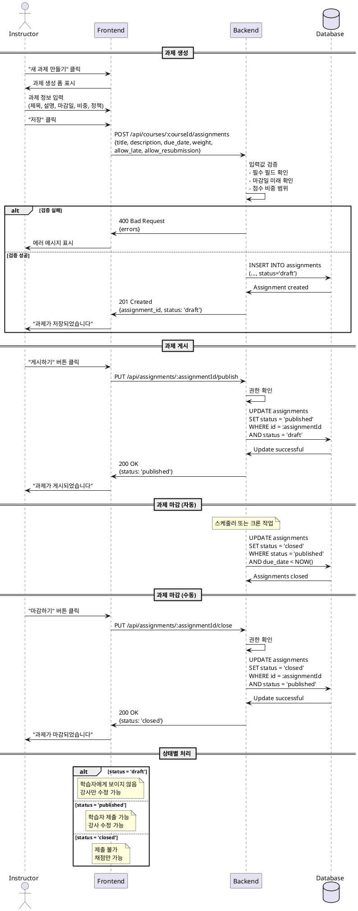

# Assignment 게시/마감 유스케이스

## Primary Actor
강사 (Instructor 역할)

## Precondition
- 강사가 로그인 상태임
- 해당 코스의 소유자임
- 코스가 published 상태임

## Trigger
강사가 과제 관리 페이지에서 과제를 생성하거나 상태를 변경

## Main Scenario

### 과제 생성 및 게시
1. 강사가 코스 관리 페이지에 접근함
2. 강사가 "새 과제 만들기" 버튼을 클릭함
3. 시스템이 과제 생성 폼을 표시함
4. 강사가 과제 정보를 입력함
   - 제목 (필수)
   - 설명
   - 마감일 (필수)
   - 점수 비중 (0-100)
   - 지각 제출 허용 여부
   - 재제출 허용 여부
5. 강사가 "저장" 버튼을 클릭함
6. 시스템이 과제를 draft 상태로 저장함
7. 강사가 "게시하기" 버튼을 클릭함
8. 시스템이 과제 상태를 published로 변경함
9. 시스템이 학습자에게 과제가 표시되도록 함

### 과제 마감
10. 시스템이 마감일 도달 시 자동으로 closed 상태로 변경함
    또는
    강사가 수동으로 "마감하기" 버튼을 클릭함
11. 시스템이 과제 상태를 closed로 변경함
12. 시스템이 더 이상 제출을 받지 않도록 차단함

## Edge Cases
- **E1: Draft 코스에 과제 생성**
  - 과제 생성은 허용하되 학습자에게 보이지 않음
  - 코스가 published되면 함께 노출
- **E2: 필수 필드 누락**
  - 시스템이 누락된 필드 표시
  - 저장 차단
- **E3: 잘못된 마감일 (과거 날짜)**
  - 시스템이 "미래 날짜를 선택하세요" 에러 표시
- **E4: 점수 비중 범위 초과**
  - 시스템이 0-100 범위 검증
  - 에러 메시지 표시
- **E5: 이미 제출물이 있는 과제 삭제 시도**
  - 시스템이 삭제 차단
  - "제출물이 있는 과제는 삭제할 수 없습니다" 메시지
- **E6: Published 상태에서 Draft로 되돌리기**
  - 시스템이 차단
  - "게시된 과제는 draft로 되돌릴 수 없습니다"

## Business Rules
- 상태 전환: draft → published → closed (역방향 불가)
- published 상태에서만 학습자에게 노출
- closed 상태에서는 제출 불가, 채점은 가능
- 마감일은 현재 시간보다 미래여야 함
- 점수 비중은 0-100 사이
- 제출물이 있는 과제는 삭제 불가

## Sequence Diagram

