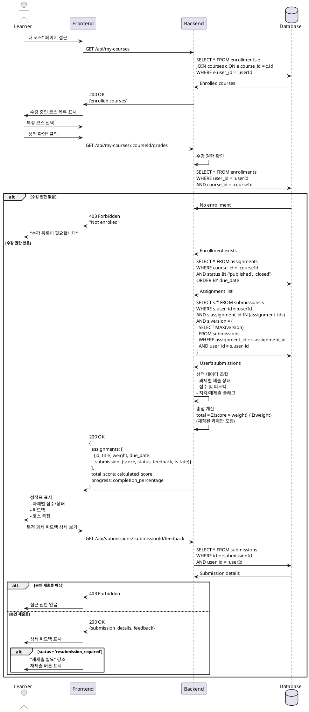

# 성적 & 피드백 열람 유스케이스

## Primary Actor
학습자 (Learner 역할)

## Precondition
- 학습자가 로그인 상태임
- 해당 코스에 수강 등록되어 있음
- 과제를 제출한 이력이 있음

## Trigger
학습자가 성적/피드백 페이지에 접근

## Main Scenario
1. 학습자가 "내 코스" 페이지에 접근함
2. 학습자가 수강 중인 코스를 선택함
3. 학습자가 "성적 확인" 메뉴를 선택함
4. 시스템이 수강 권한을 확인함
5. 시스템이 해당 코스의 모든 과제 목록을 조회함
6. 시스템이 학습자의 제출 이력을 조회함
7. 시스템이 성적 정보를 표시함
   - 과제별 점수
   - 제출 상태 (제출됨/지각/미제출)
   - 채점 상태 (채점 대기/채점 완료/재제출 요청)
   - 강사 피드백
8. 시스템이 코스 총점을 계산하여 표시함
   - 공식: Σ(점수 × 비중) / Σ(비중)
9. 학습자가 개별 과제의 상세 피드백을 확인함
10. 학습자가 재제출이 필요한 과제를 확인함

## Edge Cases
- **E1: 미제출 과제 처리**
  - 시스템이 "미제출" 상태로 표시
  - 점수를 0점으로 처리
- **E2: 아직 채점되지 않은 과제**
  - 시스템이 "채점 대기 중" 표시
  - 총점 계산에서 제외
- **E3: 재제출 요청 상태**
  - 시스템이 "재제출 필요" 강조 표시
  - 재제출 링크 제공
- **E4: 지각 제출 표시**
  - 시스템이 지각 플래그 표시
  - 감점 정책이 있는 경우 반영
- **E5: 타인의 성적 접근 시도**
  - 시스템이 본인 성적만 표시
  - 다른 학습자 정보 차단

## Business Rules
- 학습자는 본인의 성적만 열람 가능
- 채점되지 않은 과제는 총점 계산에서 제외
- 미제출 과제는 0점으로 처리
- 총점 = Σ(과제별 점수 × 비중) / Σ(제출한 과제의 비중)
- 재제출 버전이 있는 경우 최신 버전의 점수 표시

## Sequence Diagram

