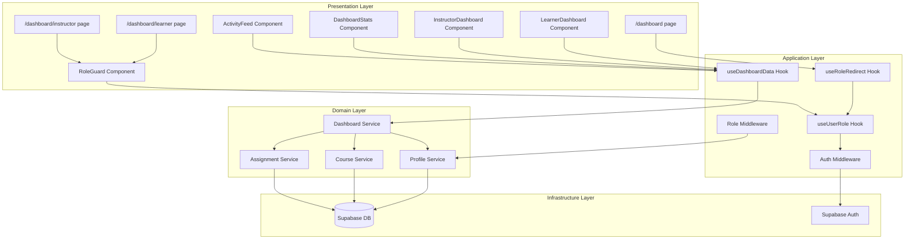

# 역할 기반 대시보드 모듈 설계

## 개요

### 모듈 목록

| 모듈명 | 위치 | 설명 |
|--------|------|------|
| **Dashboard Feature** | `src/features/dashboard/` | 역할별 대시보드 메인 기능 |
| Dashboard Router | `src/features/dashboard/backend/route.ts` | 대시보드 API 라우터 |
| Dashboard Service | `src/features/dashboard/backend/service.ts` | 대시보드 비즈니스 로직 |
| Dashboard Schema | `src/features/dashboard/backend/schema.ts` | 요청/응답 스키마 정의 |
| Dashboard Hooks | `src/features/dashboard/hooks/` | React Query 훅 |
| Dashboard Components | `src/features/dashboard/components/` | 대시보드 UI 컴포넌트 |
| **Shared Auth Middleware** | `src/backend/middleware/auth.ts` | 인증 및 역할 검증 미들웨어 |
| **Shared Role Guard** | `src/components/guards/RoleGuard.tsx` | 역할 기반 접근 제어 컴포넌트 |
| **Dashboard Pages** | `src/app/dashboard/` | Next.js 페이지 라우트 |

## Diagram



## Implementation Plan

### 1. Backend Layer

#### 1.1 Auth Middleware (`src/backend/middleware/auth.ts`)
```typescript
// 인증 및 역할 검증 미들웨어
export const withAuth = () => async (c, next) => {
  // Supabase 세션 검증
  // 사용자 프로필 조회
  // 역할 정보 context에 저장
}

export const requireRole = (roles: string[]) => async (c, next) => {
  // 역할 검증
  // 권한 없으면 403 반환
}
```

**Unit Tests:**
- 유효한 세션 검증
- 만료된 세션 처리
- 역할 권한 검증
- 403 응답 처리

#### 1.2 Dashboard Service (`src/features/dashboard/backend/service.ts`)
```typescript
export const getLearnerDashboard = async (supabase, userId) => {
  // 수강 중인 코스 조회
  // 다가오는 과제 조회
  // 최근 피드백 조회
  // 진행률 계산
}

export const getInstructorDashboard = async (supabase, userId) => {
  // 개설한 코스 조회
  // 미채점 제출물 조회
  // 최근 활동 조회
  // 통계 계산
}
```

**Unit Tests:**
- 학습자 대시보드 데이터 조회
- 강사 대시보드 데이터 조회
- 빈 데이터 처리
- 에러 처리

#### 1.3 Dashboard Router (`src/features/dashboard/backend/route.ts`)
```typescript
export const dashboardRoutes = new Hono<AppEnv>()
  .use('*', withAuth())
  .get('/learner', requireRole(['learner']), async (c) => {
    // 학습자 대시보드 데이터 반환
  })
  .get('/instructor', requireRole(['instructor']), async (c) => {
    // 강사 대시보드 데이터 반환
  })
```

#### 1.4 Dashboard Schema (`src/features/dashboard/backend/schema.ts`)
```typescript
export const LearnerDashboardSchema = z.object({
  enrolledCourses: z.array(CourseSchema),
  upcomingDeadlines: z.array(DeadlineSchema),
  recentFeedback: z.array(FeedbackSchema),
  overallProgress: z.number(),
})

export const InstructorDashboardSchema = z.object({
  myCourses: z.array(CourseSchema),
  pendingSubmissions: z.array(SubmissionSchema),
  recentActivities: z.array(ActivitySchema),
  statistics: StatsSchema,
})
```

### 2. Frontend Layer

#### 2.1 Role Guard Component (`src/components/guards/RoleGuard.tsx`)
```typescript
export const RoleGuard = ({ allowedRoles, children, fallback }) => {
  const { user, role } = useCurrentUser()

  if (!user) return <Navigate to="/auth/signin" />
  if (!allowedRoles.includes(role)) return fallback || <Navigate to="/403" />

  return children
}
```

**QA Sheet:**
- [ ] 비로그인 사용자 리다이렉트
- [ ] 권한 없는 사용자 처리
- [ ] 로딩 상태 표시
- [ ] 에러 상태 처리

#### 2.2 Dashboard Hooks (`src/features/dashboard/hooks/`)
```typescript
export const useDashboardData = () => {
  const { role } = useCurrentUser()

  return useQuery({
    queryKey: ['dashboard', role],
    queryFn: () => apiClient.get(`/api/dashboard/${role}`),
    enabled: !!role,
  })
}

export const useRoleRedirect = () => {
  const { role } = useCurrentUser()
  const router = useRouter()

  useEffect(() => {
    if (role === 'learner') router.push('/dashboard/learner')
    if (role === 'instructor') router.push('/dashboard/instructor')
  }, [role])
}
```

**QA Sheet:**
- [ ] 데이터 캐싱 동작
- [ ] 리프레시 동작
- [ ] 에러 재시도
- [ ] 역할별 리다이렉트

#### 2.3 Dashboard Components

##### LearnerDashboard (`src/features/dashboard/components/LearnerDashboard.tsx`)
```typescript
export const LearnerDashboard = () => {
  const { data, isLoading } = useDashboardData()

  return (
    <div className="grid grid-cols-1 md:grid-cols-2 lg:grid-cols-3 gap-6">
      <EnrolledCoursesCard courses={data?.enrolledCourses} />
      <UpcomingDeadlinesWidget deadlines={data?.upcomingDeadlines} />
      <RecentFeedbackPanel feedback={data?.recentFeedback} />
      <ProgressStats progress={data?.overallProgress} />
    </div>
  )
}
```

**QA Sheet:**
- [ ] 반응형 레이아웃
- [ ] 로딩 스켈레톤
- [ ] 빈 상태 처리
- [ ] 에러 메시지
- [ ] 접근성 (ARIA)

##### InstructorDashboard (`src/features/dashboard/components/InstructorDashboard.tsx`)
```typescript
export const InstructorDashboard = () => {
  const { data, isLoading } = useDashboardData()

  return (
    <div className="grid grid-cols-1 md:grid-cols-2 lg:grid-cols-3 gap-6">
      <MyCoursesList courses={data?.myCourses} />
      <PendingSubmissionsAlert submissions={data?.pendingSubmissions} />
      <ActivityFeed activities={data?.recentActivities} />
      <StatisticsOverview stats={data?.statistics} />
    </div>
  )
}
```

**QA Sheet:**
- [ ] 반응형 레이아웃
- [ ] 실시간 업데이트
- [ ] 우선순위 표시
- [ ] 빠른 액션 버튼
- [ ] 통계 시각화

### 3. Page Layer

#### 3.1 Dashboard Index (`src/app/dashboard/page.tsx`)
```typescript
'use client'

export default function DashboardPage() {
  useRoleRedirect() // 역할에 따라 자동 리다이렉트

  return <LoadingSpinner />
}
```

#### 3.2 Learner Dashboard (`src/app/dashboard/learner/page.tsx`)
```typescript
'use client'

export default function LearnerDashboardPage() {
  return (
    <RoleGuard allowedRoles={['learner']}>
      <LearnerDashboard />
    </RoleGuard>
  )
}
```

#### 3.3 Instructor Dashboard (`src/app/dashboard/instructor/page.tsx`)
```typescript
'use client'

export default function InstructorDashboardPage() {
  return (
    <RoleGuard allowedRoles={['instructor']}>
      <InstructorDashboard />
    </RoleGuard>
  )
}
```

### 4. Shared Components

#### 4.1 Stats Card (`src/components/shared/StatsCard.tsx`)
```typescript
export const StatsCard = ({ title, value, icon, trend }) => {
  return (
    <Card>
      <CardHeader>
        <CardTitle>{title}</CardTitle>
      </CardHeader>
      <CardContent>
        <div className="flex items-center justify-between">
          <span className="text-3xl font-bold">{value}</span>
          {icon}
        </div>
        {trend && <TrendIndicator value={trend} />}
      </CardContent>
    </Card>
  )
}
```

#### 4.2 Activity Item (`src/components/shared/ActivityItem.tsx`)
```typescript
export const ActivityItem = ({ type, title, timestamp, user }) => {
  const icon = getActivityIcon(type)

  return (
    <div className="flex items-start gap-3 p-3 hover:bg-muted rounded-lg">
      {icon}
      <div className="flex-1">
        <p className="font-medium">{title}</p>
        <p className="text-sm text-muted-foreground">
          {user} • {formatRelativeTime(timestamp)}
        </p>
      </div>
    </div>
  )
}
```

### 5. Testing Strategy

#### Backend Tests
```typescript
// src/features/dashboard/backend/__tests__/service.test.ts
describe('Dashboard Service', () => {
  describe('getLearnerDashboard', () => {
    it('should return enrolled courses with progress')
    it('should return upcoming deadlines sorted by date')
    it('should return only recent feedback (last 7 days)')
    it('should calculate overall progress correctly')
  })

  describe('getInstructorDashboard', () => {
    it('should return only owned courses')
    it('should count pending submissions correctly')
    it('should return recent activities sorted by timestamp')
    it('should calculate statistics accurately')
  })
})
```

#### Frontend Tests
```typescript
// src/features/dashboard/components/__tests__/LearnerDashboard.test.tsx
describe('LearnerDashboard', () => {
  it('should render loading state')
  it('should render enrolled courses')
  it('should handle empty state')
  it('should show error message on failure')
  it('should be responsive')
})
```

### 6. API Integration

```typescript
// src/lib/remote/dashboard-client.ts
export const dashboardClient = {
  getLearnerDashboard: () =>
    apiClient.get('/api/dashboard/learner'),

  getInstructorDashboard: () =>
    apiClient.get('/api/dashboard/instructor'),

  getActivityFeed: (limit = 10) =>
    apiClient.get('/api/dashboard/activities', { params: { limit } }),
}
```

### 7. Error Handling

```typescript
// src/features/dashboard/lib/errors.ts
export class DashboardError extends AppError {
  constructor(code: string, message: string) {
    super(`DASHBOARD_${code}`, message)
  }
}

export const dashboardErrors = {
  UNAUTHORIZED: new DashboardError('UNAUTHORIZED', '대시보드 접근 권한이 없습니다'),
  DATA_LOAD_FAILED: new DashboardError('DATA_LOAD_FAILED', '대시보드 데이터를 불러올 수 없습니다'),
}
```