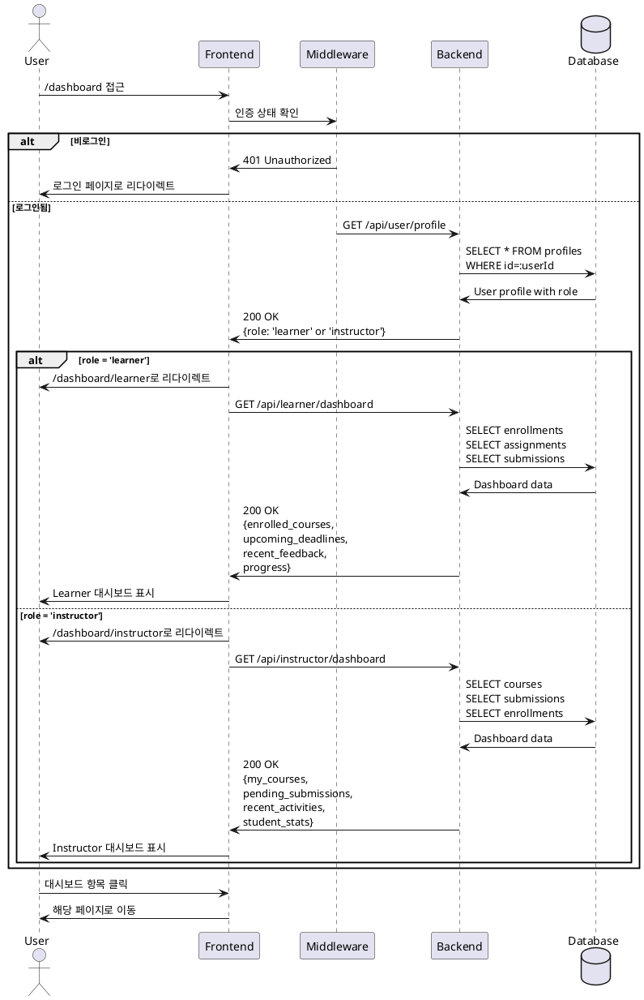

# 역할 기반 대시보드 유스케이스

## Primary Actor
로그인한 사용자 (Learner 또는 Instructor 역할)

## Precondition
- 사용자가 로그인함
- 프로필 정보가 완성됨
- 사용자의 역할이 확정됨 (learner 또는 instructor)

## Trigger
사용자가 /dashboard 경로에 접근

## Main Scenario
1. 시스템이 사용자의 역할을 확인함
2. 시스템이 역할에 맞는 대시보드로 자동 리다이렉트함
   - Learner → /dashboard/learner
   - Instructor → /dashboard/instructor
3. **Learner 대시보드의 경우:**
   - 수강 중인 코스 목록 표시
   - 다가오는 과제 마감일 표시
   - 최근 받은 피드백 알림 표시
   - 전체 학습 진행률 표시
   - 빠른 액세스 메뉴 제공 (내 코스, 코스 탐색)
4. **Instructor 대시보드의 경우:**
   - 내가 개설한 코스 목록 표시
   - 미채점 제출물 개수 표시
   - 최근 학생 활동 로그 표시
   - 코스별 수강생 통계 표시
   - 빠른 액세스 메뉴 제공 (코스 생성, 과제 관리)
5. 사용자가 대시보드에서 원하는 기능으로 이동

## Edge Cases
- **E1: 역할이 없는 사용자**
  - 시스템이 온보딩 페이지(/auth/onboarding)로 리다이렉트
- **E2: 비로그인 사용자**
  - 시스템이 로그인 페이지(/auth/signin)로 리다이렉트
- **E3: 데이터 로딩 실패**
  - 시스템이 에러 메시지와 함께 재시도 옵션 표시
- **E4: 권한 없는 대시보드 접근**
  - Learner가 /dashboard/instructor 접근 시 403 에러
  - Instructor가 /dashboard/learner 접근 시 403 에러

## Business Rules
- 역할에 따른 자동 라우팅 필수
- 각 역할별 대시보드는 독립적인 UI/UX 제공
- 실시간 데이터 동기화 (새로운 제출물, 피드백 등)
- 모바일 반응형 디자인 필수
- 페이지네이션 적용 (목록이 10개 초과 시)

## Sequence Diagram



## UI Components

### Learner Dashboard
- **수강 중인 코스 카드**
  - 코스 제목, 진행률 바
  - 다음 과제 정보
  - "계속 학습하기" 버튼
- **과제 마감일 위젯**
  - 날짜별 정렬
  - 남은 시간 표시
  - 제출 상태 뱃지
- **피드백 알림 패널**
  - 최신 채점 결과
  - 점수 및 간단 피드백
  - "자세히 보기" 링크
- **진행률 통계**
  - 전체 완료율
  - 주간 학습 시간
  - 획득 점수 평균

### Instructor Dashboard
- **내 코스 관리 카드**
  - 코스별 상태 (draft/published/archived)
  - 수강생 수
  - "관리하기" 버튼
- **미채점 제출물 알림**
  - 과제별 대기 중인 채점 수
  - "채점하기" 빠른 링크
  - 우선순위 표시 (마감일 기준)
- **학생 활동 로그**
  - 최근 제출물
  - 신규 수강신청
  - 질문/피드백 요청
- **통계 대시보드**
  - 전체 수강생 수
  - 과제 제출률
  - 평균 점수 분포

## API Endpoints

### 공통
```
GET /api/user/profile - 사용자 프로필 및 역할 조회
```

### Learner Dashboard
```
GET /api/learner/dashboard - 학습자 대시보드 데이터
GET /api/learner/courses - 수강 중인 코스 목록
GET /api/learner/deadlines - 다가오는 과제 마감일
GET /api/learner/feedback/recent - 최근 받은 피드백
```

### Instructor Dashboard
```
GET /api/instructor/dashboard - 강사 대시보드 데이터
GET /api/instructor/courses - 개설한 코스 목록
GET /api/instructor/submissions/pending - 미채점 제출물
GET /api/instructor/activities/recent - 최근 학생 활동
GET /api/instructor/stats - 통계 데이터
```