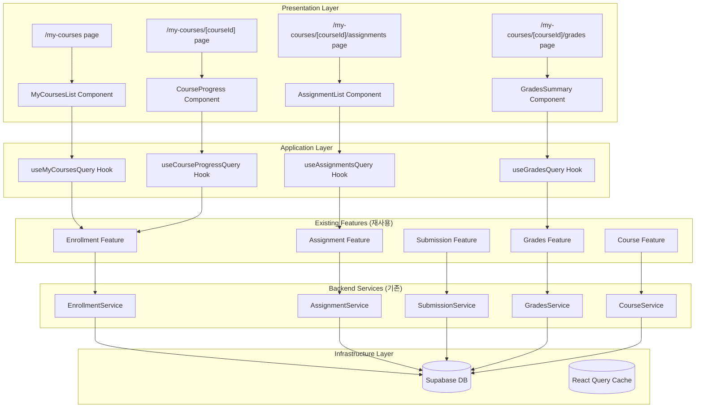

# 내 수강 코스 관리 모듈 설계 (수정본)

## 개요

### 모듈 목록 (기존 구조 활용)

| 모듈명 | 위치 | 설명 |
|--------|------|------|
| **Enrollment Feature 확장** | `src/features/enrollment/` | 기존 enrollment 기능 확장 |
| Enrollment Service 확장 | `src/features/enrollment/backend/service.ts` | 진행률 계산 추가 |
| Enrollment Router 확장 | `src/features/enrollment/backend/route.ts` | 라우트 추가 |
| **Assignment Feature 활용** | `src/features/assignment/` | 기존 assignment 기능 활용 |
| **Submission Feature 활용** | `src/features/submission/` | 기존 submission 기능 활용 |
| **Grades Feature 활용** | `src/features/grades/` | 기존 grades 기능 활용 |
| My Courses Components | `src/features/enrollment/components/` | 수강 코스 UI 컴포넌트 |
| **My Courses Pages** | `src/app/my-courses/` | Next.js 페이지 라우트 |

## Diagram



## Implementation Plan

### 1. Backend Layer (기존 모듈 확장)

#### 1.1 Enrollment Service 확장 (`src/features/enrollment/backend/service.ts`)
```typescript
// 기존 EnrollmentService 클래스에 메소드 추가

export class EnrollmentService {
  // ... 기존 메소드들 ...

  /**
   * 수강 중인 코스와 진행률 조회 (추가)
   */
  async getMyCoursesWithProgress(userId: string) {
    // 기존 getMyEnrollments 메소드 확장
    const { data: enrollments, error } = await this.supabase
      .from('enrollments')
      .select(`
        *,
        courses!inner(
          id,
          title,
          description,
          instructor_id,
          status,
          profiles!courses_instructor_id_fkey(name)
        )
      `)
      .eq('user_id', userId)
      .eq('courses.status', 'published')
      .order('enrolled_at', { ascending: false });

    if (error) throw error;

    // 각 코스별 진행률 계산
    const coursesWithProgress = await Promise.all(
      enrollments.map(async (enrollment) => {
        const progress = await this.calculateCourseProgress(
          enrollment.course_id,
          userId
        );
        return {
          ...enrollment,
          progress,
          nextAssignment: await this.getNextAssignment(enrollment.course_id, userId)
        };
      })
    );

    return coursesWithProgress;
  }

  /**
   * 코스 진행률 계산 (추가)
   */
  async calculateCourseProgress(courseId: string, userId: string) {
    // 전체 과제 수
    const { count: totalAssignments } = await this.supabase
      .from('assignments')
      .select('*', { count: 'exact', head: true })
      .eq('course_id', courseId)
      .eq('status', 'published');

    // 제출된 과제 수
    const { count: submittedAssignments } = await this.supabase
      .from('submissions')
      .select('*', { count: 'exact', head: true })
      .eq('user_id', userId)
      .in('assignment_id',
        this.supabase
          .from('assignments')
          .select('id')
          .eq('course_id', courseId)
      );

    if (!totalAssignments || totalAssignments === 0) return 0;

    return Math.round((submittedAssignments! / totalAssignments) * 100);
  }

  /**
   * 다음 과제 정보 조회 (추가)
   */
  async getNextAssignment(courseId: string, userId: string) {
    const { data } = await this.supabase
      .from('assignments')
      .select('id, title, due_date')
      .eq('course_id', courseId)
      .eq('status', 'published')
      .gt('due_date', new Date().toISOString())
      .order('due_date', { ascending: true })
      .limit(1)
      .single();

    return data;
  }
}
```

#### 1.2 Enrollment Router 확장 (`src/features/enrollment/backend/route.ts`)
```typescript
// 기존 enrollmentRoutes에 라우트 추가

export const enrollmentRoutes = new Hono<AppEnv>()
  // ... 기존 라우트들 ...

  /**
   * GET /api/my-courses/:courseId
   * 특정 수강 코스 상세 조회 (추가)
   */
  .get('/my-courses/:courseId', async (c) => {
    const supabase = c.get('supabase');
    const logger = c.get('logger');
    const courseId = c.req.param('courseId');

    const { data: { user }, error: authError } = await supabase.auth.getUser();

    if (authError || !user) {
      logger.error('Auth error:', authError);
      return failure(c, ProfileErrors.UNAUTHORIZED_ACCESS);
    }

    const service = new EnrollmentService(supabase);

    try {
      // 수강 여부 확인
      const enrollment = await service.checkEnrollment(user.id, courseId);
      if (!enrollment) {
        return failure(c, EnrollmentErrors.NOT_ENROLLED);
      }

      // 코스 상세 정보와 진행률
      const courseDetail = await service.getCourseDetailForStudent(courseId, user.id);
      return success(c, courseDetail);
    } catch (error) {
      logger.error(`Course detail error:`, error);
      return failure(c, error);
    }
  })

  /**
   * GET /api/my-courses/:courseId/progress
   * 코스 진행률 조회 (추가)
   */
  .get('/my-courses/:courseId/progress', async (c) => {
    const supabase = c.get('supabase');
    const courseId = c.req.param('courseId');

    const { data: { user } } = await supabase.auth.getUser();
    if (!user) return failure(c, ProfileErrors.UNAUTHORIZED_ACCESS);

    const service = new EnrollmentService(supabase);
    const progress = await service.calculateCourseProgress(courseId, user.id);

    return success(c, { progress });
  });
```

### 2. Frontend Layer (기존 hooks 활용 + 신규 컴포넌트)

#### 2.1 My Courses Hooks (`src/features/enrollment/hooks/`)

```typescript
// useMyCoursesQuery.ts (신규)
import { useQuery } from '@tanstack/react-query';
import { apiClient } from '@/lib/remote/api-client';

export const useMyCoursesQuery = () => {
  return useQuery({
    queryKey: ['my-courses'],
    queryFn: () => apiClient.get('/api/my-courses'),
    staleTime: 5 * 60 * 1000,
  });
};

// useCourseProgressQuery.ts (신규)
export const useCourseProgressQuery = (courseId: string) => {
  return useQuery({
    queryKey: ['course-progress', courseId],
    queryFn: () => apiClient.get(`/api/my-courses/${courseId}/progress`),
    enabled: !!courseId,
  });
};
```

#### 2.2 My Courses Components (`src/features/enrollment/components/`)

```typescript
// MyCoursesList.tsx (신규)
'use client';

import { useMyCoursesQuery } from '../hooks/useMyCoursesQuery';
import { CourseCard } from '@/components/shared/CourseCard';

export const MyCoursesList = () => {
  const { data: courses, isLoading, error } = useMyCoursesQuery();

  if (isLoading) return <div>로딩 중...</div>;
  if (error) return <div>오류가 발생했습니다</div>;
  if (!courses?.length) {
    return (
      <div className="text-center py-12">
        <p>수강 중인 코스가 없습니다</p>
        <Link href="/courses">
          <Button>코스 둘러보기</Button>
        </Link>
      </div>
    );
  }

  return (
    <div className="grid grid-cols-1 md:grid-cols-2 lg:grid-cols-3 gap-6">
      {courses.map((enrollment: any) => (
        <CourseCard
          key={enrollment.id}
          course={enrollment.courses}
          progress={enrollment.progress}
          enrolledAt={enrollment.enrolled_at}
          nextAssignment={enrollment.nextAssignment}
        />
      ))}
    </div>
  );
};
```

### 3. Page Layer (IA 문서와 일치)

#### 3.1 My Courses Index (`src/app/my-courses/page.tsx`)
```typescript
'use client';

import { MyCoursesList } from '@/features/enrollment/components/MyCoursesList';
import { useCurrentUser } from '@/features/auth/hooks/useCurrentUser';
import { redirect } from 'next/navigation';

export default function MyCoursesPage() {
  const { user } = useCurrentUser();

  if (!user) {
    redirect('/auth/signin');
  }

  if (user.role !== 'learner') {
    redirect('/dashboard');
  }

  return (
    <div className="container mx-auto py-8">
      <h1 className="text-3xl font-bold mb-6">내 코스</h1>
      <MyCoursesList />
    </div>
  );
}
```

#### 3.2 Course Detail (`src/app/my-courses/[courseId]/page.tsx`)
```typescript
'use client';

import { use } from 'react';
import { AssignmentList } from '@/features/assignment/components/AssignmentList';
import { useCourseProgressQuery } from '@/features/enrollment/hooks/useCourseProgressQuery';

interface PageProps {
  params: Promise<{ courseId: string }>;
}

export default function MyCourseDetailPage({ params }: PageProps) {
  const { courseId } = use(params);
  const { data: progress } = useCourseProgressQuery(courseId);

  return (
    <div className="container mx-auto py-8">
      <div className="mb-6">
        <h1 className="text-3xl font-bold">코스 상세</h1>
        <div className="mt-4">
          <div className="text-sm text-muted-foreground">진행률</div>
          <div className="w-full bg-gray-200 rounded-full h-2.5 mt-2">
            <div
              className="bg-primary h-2.5 rounded-full"
              style={{ width: `${progress?.progress || 0}%` }}
            />
          </div>
        </div>
      </div>
      <AssignmentList courseId={courseId} />
    </div>
  );
}
```

#### 3.3 Assignments Page (`src/app/my-courses/[courseId]/assignments/[assignmentId]/page.tsx`)
```typescript
// 기존 assignment feature 활용
'use client';

import { use } from 'react';
import { AssignmentDetail } from '@/features/assignment/components/AssignmentDetail';

interface PageProps {
  params: Promise<{ courseId: string; assignmentId: string }>;
}

export default function AssignmentDetailPage({ params }: PageProps) {
  const { courseId, assignmentId } = use(params);

  return <AssignmentDetail courseId={courseId} assignmentId={assignmentId} />;
}
```

#### 3.4 Submit Page (`src/app/my-courses/[courseId]/assignments/[assignmentId]/submit/page.tsx`)
```typescript
// 기존 submission feature 활용
'use client';

import { use } from 'react';
import { SubmissionForm } from '@/features/submission/components/SubmissionForm';

interface PageProps {
  params: Promise<{ courseId: string; assignmentId: string }>;
}

export default function SubmitPage({ params }: PageProps) {
  const { assignmentId } = use(params);

  return (
    <div className="container mx-auto py-8">
      <h1 className="text-3xl font-bold mb-6">과제 제출</h1>
      <SubmissionForm assignmentId={assignmentId} />
    </div>
  );
}
```

#### 3.5 Feedback Page (`src/app/my-courses/[courseId]/assignments/[assignmentId]/feedback/page.tsx`)
```typescript
// 기존 grades feature 활용
'use client';

import { use } from 'react';
import { FeedbackView } from '@/features/grades/components/FeedbackView';

interface PageProps {
  params: Promise<{ assignmentId: string }>;
}

export default function FeedbackPage({ params }: PageProps) {
  const { assignmentId } = use(params);

  return <FeedbackView assignmentId={assignmentId} />;
}
```

#### 3.6 Grades Page (`src/app/my-courses/[courseId]/grades/page.tsx`)
```typescript
// 기존 grades feature 활용
'use client';

import { use } from 'react';
import { GradesSummary } from '@/features/grades/components/GradesSummary';

interface PageProps {
  params: Promise<{ courseId: string }>;
}

export default function GradesPage({ params }: PageProps) {
  const { courseId } = use(params);

  return <GradesSummary courseId={courseId} />;
}
```

### 4. API Routes 정리 (IA 문서와 완전 일치)

```typescript
// IA 문서 기준 API 엔드포인트
GET  /api/my-courses                                    // 수강 중인 코스 목록 (기존)
GET  /api/my-courses/:courseId                          // 코스 상세 (추가)
GET  /api/my-courses/:courseId/progress                 // 진행률 (추가)
GET  /api/my-courses/:courseId/assignments              // 과제 목록 (assignment feature)
GET  /api/assignments/:id                               // 과제 상세 (assignment feature)
POST /api/assignments/:id/submit                        // 제출 (submission feature)
GET  /api/assignments/:id/feedback                      // 피드백 (grades feature)
GET  /api/my-courses/:courseId/grades                   // 성적 (grades feature)
DELETE /api/courses/:id/enroll                          // 수강 철회 (기존)
```

### 5. Testing Strategy

#### Backend Tests
```typescript
// src/features/enrollment/backend/__tests__/service.test.ts
describe('EnrollmentService Extensions', () => {
  describe('getMyCoursesWithProgress', () => {
    it('should return enrolled courses with correct progress');
    it('should calculate progress based on submissions');
    it('should include next assignment info');
  });

  describe('calculateCourseProgress', () => {
    it('should return 0 for courses with no assignments');
    it('should calculate percentage correctly');
    it('should handle partially submitted assignments');
  });
});
```

### 6. 기존 코드와의 통합 포인트

1. **EnrollmentService**: 기존 클래스에 메소드 추가
2. **Assignment/Submission/Grades Features**: 그대로 활용
3. **Auth/Profile Features**: 권한 체크에 활용
4. **Shared Components**: CourseCard 등 재사용

이 설계는 기존 코드를 최대한 활용하면서 IA 문서의 라우트 구조를 완벽히 따릅니다.