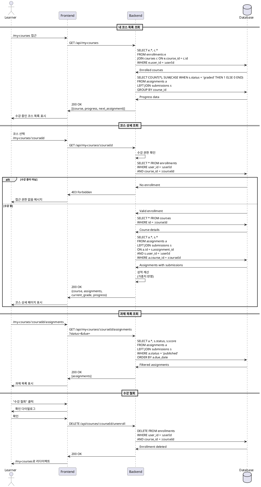

# 내 수강 코스 관리 유스케이스

## Primary Actor
학습자 (Learner 역할)

## Precondition
- 사용자가 Learner 역할로 로그인함
- 하나 이상의 코스에 수강 등록됨

## Trigger
학습자가 /my-courses 경로에 접근

## Main Scenario
1. 시스템이 학습자의 수강 중인 코스 목록을 표시함
   - 코스별 진행률 표시
   - 최근 학습 날짜 표시
   - 다음 과제 정보 표시
2. 학습자가 특정 코스를 선택함 (/my-courses/[courseId])
3. 시스템이 코스 상세 정보를 표시함
   - 코스 개요
   - 전체 진행 상황
   - 과제 목록 및 상태
   - 현재 성적
4. 학습자가 과제 탭을 선택함 (/my-courses/[courseId]/assignments)
5. 시스템이 과제 목록을 표시함
   - 과제별 상태 (미제출/제출됨/채점됨)
   - 마감일 및 남은 시간
   - 점수 (채점된 경우)
6. 학습자가 특정 과제를 선택함
7. 시스템이 과제 상세 페이지로 이동

## Alternative Flows

### AF1: 수강 철회
1. 학습자가 코스 상세 페이지에서 "수강 철회" 버튼 클릭
2. 시스템이 확인 다이얼로그 표시
3. 학습자가 확인함
4. 시스템이 enrollment 레코드를 삭제
5. 시스템이 코스 목록 페이지로 리다이렉트

### AF2: 과제 목록 필터링
1. 학습자가 과제 목록에서 필터 적용
   - 상태별 (전체/미제출/제출됨/채점됨)
   - 기한별 (지난 과제/현재 과제/미래 과제)
2. 시스템이 필터링된 과제 목록 표시

## Edge Cases
- **E1: 수강 중인 코스가 없음**
  - 시스템이 "수강 중인 코스가 없습니다" 메시지 표시
  - "코스 둘러보기" 버튼 제공
- **E2: 코스가 archived 상태로 변경됨**
  - 시스템이 읽기 전용 모드로 표시
  - 새로운 제출 불가 안내
- **E3: 과제가 없는 코스**
  - 시스템이 "등록된 과제가 없습니다" 메시지 표시
- **E4: 접근 권한 없는 코스 접근 시도**
  - 시스템이 403 에러 표시

## Business Rules
- 수강 등록된 코스만 접근 가능
- 진행률은 (제출한 과제 수 / 전체 과제 수) × 100
- 성적은 과제별 가중치를 반영하여 계산
- archived 코스는 읽기 전용
- 수강 철회 시 제출한 과제 데이터는 보존

## Sequence Diagram



## UI Components

### 내 코스 목록 페이지 (/my-courses)
- **코스 카드 그리드**
  - 코스 썸네일/배너
  - 코스 제목 및 강사명
  - 진행률 바 (시각적 표시)
  - 다음 과제 마감일
  - "계속 학습" 버튼
- **필터/정렬 옵션**
  - 진행 상태별 (진행 중/완료)
  - 최근 학습순/등록일순
- **통계 요약**
  - 총 수강 코스 수
  - 평균 진행률

### 코스 상세 페이지 (/my-courses/[courseId])
- **코스 헤더**
  - 코스 제목 및 설명
  - 강사 정보
  - 전체 진행률
  - 현재 성적
- **탭 네비게이션**
  - 개요
  - 과제
  - 성적
  - 공지사항 (optional)
- **빠른 액세스**
  - 최근 피드백 알림
  - 다가오는 마감일
- **액션 버튼**
  - 수강 철회
  - 질문하기 (optional)

### 과제 목록 페이지 (/my-courses/[courseId]/assignments)
- **과제 테이블/리스트**
  - 과제 제목
  - 마감일 (D-day 표시)
  - 상태 뱃지 (미제출/제출됨/채점됨/지각)
  - 점수 (채점된 경우)
  - 액션 버튼 (제출/수정/피드백 확인)
- **필터 옵션**
  - 상태별
  - 기한별
- **요약 정보**
  - 총 과제 수
  - 완료된 과제 수
  - 평균 점수

## API Endpoints

```
# 내 코스 관련
GET /api/my-courses - 수강 중인 코스 목록
GET /api/my-courses/:courseId - 코스 상세 정보
DELETE /api/courses/:courseId/unenroll - 수강 철회

# 과제 관련
GET /api/my-courses/:courseId/assignments - 코스별 과제 목록
GET /api/my-courses/:courseId/grades - 성적 요약

# 진행률 관련
GET /api/my-courses/:courseId/progress - 진행 상황 상세
```

## Data Models

### Response: My Course List
```json
{
  "courses": [
    {
      "course_id": "uuid",
      "title": "string",
      "instructor_name": "string",
      "enrolled_at": "datetime",
      "progress": 75,
      "next_assignment": {
        "title": "string",
        "due_date": "datetime"
      },
      "last_accessed": "datetime"
    }
  ],
  "total": 5,
  "avg_progress": 60
}
```

### Response: Course Detail
```json
{
  "course": {
    "id": "uuid",
    "title": "string",
    "description": "string",
    "instructor": {...}
  },
  "enrollment": {
    "enrolled_at": "datetime",
    "progress": 75,
    "current_grade": 85
  },
  "assignments": [...],
  "stats": {
    "total_assignments": 10,
    "completed_assignments": 7,
    "average_score": 85
  }
}
```