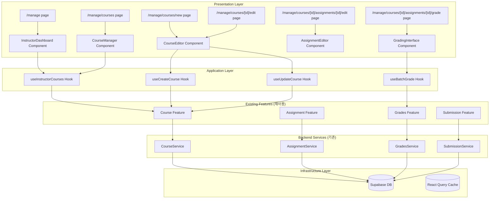

# 강사 코스 관리 모듈 설계 (수정본)

## 개요

### 모듈 목록 (기존 구조 활용)

| 모듈명 | 위치 | 설명 |
|--------|------|------|
| **Course Feature 확장** | `src/features/course/` | 기존 course 기능 확장 |
| Course Service 확장 | `src/features/course/backend/service.ts` | 강사용 메소드 추가 |
| Course Router 확장 | `src/features/course/backend/route.ts` | 강사용 라우트 추가 |
| **Assignment Feature 활용** | `src/features/assignment/` | 기존 assignment 기능 활용 |
| **Grades Feature 확장** | `src/features/grades/` | 기존 grades 기능 확장 |
| Grades Service 확장 | `src/features/grades/backend/service.ts` | 일괄 채점 메소드 추가 |
| **Manage Components** | `src/features/course/components/manage/` | 강사 관리 UI 컴포넌트 |
| **Manage Pages** | `src/app/manage/` | Next.js 페이지 라우트 |

## Diagram



## Implementation Plan

### 1. Backend Layer (기존 모듈 확장)

#### 1.1 Course Service 확장 (`src/features/course/backend/service.ts`)
```typescript
// 기존 CourseService 클래스에 메소드 추가

export class CourseService {
  // ... 기존 메소드들 ...

  /**
   * 강사의 코스 목록 조회 (추가)
   */
  async getInstructorCourses(instructorId: string) {
    const { data, error } = await this.supabase
      .from('courses')
      .select(`
        *,
        enrollments(count),
        assignments(
          id,
          submissions(count)
        )
      `)
      .eq('instructor_id', instructorId)
      .order('created_at', { ascending: false });

    if (error) throw error;

    // 통계 계산
    const coursesWithStats = data.map(course => ({
      ...course,
      studentCount: course.enrollments[0]?.count || 0,
      pendingGrading: course.assignments.reduce((sum, a) =>
        sum + (a.submissions[0]?.count || 0), 0
      )
    }));

    return coursesWithStats;
  }

  /**
   * 코스 생성 (추가)
   */
  async createCourse(instructorId: string, data: CreateCourseInput) {
    const { data: course, error } = await this.supabase
      .from('courses')
      .insert({
        ...data,
        instructor_id: instructorId,
        status: 'draft'
      })
      .select()
      .single();

    if (error) throw error;
    return course;
  }

  /**
   * 코스 업데이트 (추가)
   */
  async updateCourse(courseId: string, instructorId: string, data: UpdateCourseInput) {
    // 소유권 확인
    const { data: course } = await this.supabase
      .from('courses')
      .select('instructor_id')
      .eq('id', courseId)
      .single();

    if (course?.instructor_id !== instructorId) {
      throw CourseErrors.UNAUTHORIZED;
    }

    const { data: updated, error } = await this.supabase
      .from('courses')
      .update(data)
      .eq('id', courseId)
      .select()
      .single();

    if (error) throw error;
    return updated;
  }

  /**
   * 코스 게시 (추가)
   */
  async publishCourse(courseId: string, instructorId: string) {
    // 소유권 및 게시 조건 확인
    const { data: course } = await this.supabase
      .from('courses')
      .select(`
        *,
        assignments(count)
      `)
      .eq('id', courseId)
      .single();

    if (course?.instructor_id !== instructorId) {
      throw CourseErrors.UNAUTHORIZED;
    }

    if (course.assignments[0]?.count === 0) {
      throw new Error('코스에 최소 1개 이상의 과제가 필요합니다');
    }

    const { error } = await this.supabase
      .from('courses')
      .update({ status: 'published' })
      .eq('id', courseId);

    if (error) throw error;
  }
}
```

#### 1.2 Course Router 확장 (`src/features/course/backend/route.ts`)
```typescript
// 기존 courseRoutes에 라우트 추가

export const courseRoutes = new Hono<AppEnv>()
  // ... 기존 라우트들 ...

  /**
   * GET /api/manage/courses
   * 강사의 코스 목록 조회 (추가)
   */
  .get('/manage/courses', async (c) => {
    const supabase = c.get('supabase');
    const logger = c.get('logger');

    const { data: { user }, error: authError } = await supabase.auth.getUser();

    if (authError || !user) {
      logger.error('Auth error:', authError);
      return failure(c, ProfileErrors.UNAUTHORIZED_ACCESS);
    }

    // 역할 확인
    const { data: profile } = await supabase
      .from('profiles')
      .select('role')
      .eq('id', user.id)
      .single();

    if (profile?.role !== 'instructor') {
      return failure(c, ProfileErrors.FORBIDDEN_ACCESS);
    }

    const service = new CourseService(supabase);

    try {
      const courses = await service.getInstructorCourses(user.id);
      return success(c, courses);
    } catch (error) {
      logger.error('Instructor courses error:', error);
      return failure(c, error);
    }
  })

  /**
   * POST /api/manage/courses
   * 새 코스 생성 (추가)
   */
  .post('/manage/courses',
    zValidator('json', CreateCourseSchema),
    async (c) => {
      const supabase = c.get('supabase');
      const data = c.req.valid('json');

      const { data: { user } } = await supabase.auth.getUser();
      if (!user) return failure(c, ProfileErrors.UNAUTHORIZED_ACCESS);

      const service = new CourseService(supabase);
      const course = await service.createCourse(user.id, data);
      return success(c, course, 201);
    }
  )

  /**
   * PUT /api/manage/courses/:id
   * 코스 수정 (추가)
   */
  .put('/manage/courses/:id',
    zValidator('json', UpdateCourseSchema),
    async (c) => {
      const supabase = c.get('supabase');
      const courseId = c.req.param('id');
      const data = c.req.valid('json');

      const { data: { user } } = await supabase.auth.getUser();
      if (!user) return failure(c, ProfileErrors.UNAUTHORIZED_ACCESS);

      const service = new CourseService(supabase);
      const course = await service.updateCourse(courseId, user.id, data);
      return success(c, course);
    }
  )

  /**
   * PUT /api/manage/courses/:id/publish
   * 코스 게시 (추가)
   */
  .put('/manage/courses/:id/publish', async (c) => {
    const supabase = c.get('supabase');
    const courseId = c.req.param('id');

    const { data: { user } } = await supabase.auth.getUser();
    if (!user) return failure(c, ProfileErrors.UNAUTHORIZED_ACCESS);

    const service = new CourseService(supabase);
    await service.publishCourse(courseId, user.id);
    return success(c, { message: '코스가 게시되었습니다' });
  });
```

#### 1.3 Grades Service 확장 (`src/features/grades/backend/service.ts`)
```typescript
// 기존 GradesService 클래스에 메소드 추가

export class GradesService {
  // ... 기존 메소드들 ...

  /**
   * 일괄 채점 (추가)
   */
  async batchGradeSubmissions(
    submissionIds: string[],
    instructorId: string,
    gradeData: {
      score: number;
      feedback?: string;
    }
  ) {
    // 제출물의 과제와 코스 소유권 확인
    const { data: submissions } = await this.supabase
      .from('submissions')
      .select(`
        id,
        assignments!inner(
          courses!inner(
            instructor_id
          )
        )
      `)
      .in('id', submissionIds);

    const unauthorized = submissions?.some(
      sub => sub.assignments.courses.instructor_id !== instructorId
    );

    if (unauthorized) {
      throw GradesErrors.UNAUTHORIZED;
    }

    // 일괄 업데이트
    const { error } = await this.supabase
      .from('submissions')
      .update({
        score: gradeData.score,
        feedback: gradeData.feedback,
        graded_at: new Date().toISOString(),
        status: 'graded'
      })
      .in('id', submissionIds);

    if (error) throw error;
  }

  /**
   * 코스의 미채점 제출물 조회 (추가)
   */
  async getPendingSubmissions(courseId: string, instructorId: string) {
    const { data, error } = await this.supabase
      .from('submissions')
      .select(`
        *,
        user:profiles!submissions_user_id_fkey(name, email),
        assignment:assignments!inner(
          title,
          courses!inner(instructor_id)
        )
      `)
      .eq('assignment.courses.instructor_id', instructorId)
      .eq('assignment.courses.id', courseId)
      .is('graded_at', null)
      .order('submitted_at', { ascending: true });

    if (error) throw error;
    return data;
  }
}
```

#### 1.4 Grades Router 확장 (`src/features/grades/backend/route.ts`)
```typescript
// 기존 gradesRoutes에 라우트 추가

export const gradesRoutes = new Hono<AppEnv>()
  // ... 기존 라우트들 ...

  /**
   * POST /api/manage/submissions/batch-grade
   * 일괄 채점 (추가)
   */
  .post('/manage/submissions/batch-grade',
    zValidator('json', BatchGradeSchema),
    async (c) => {
      const supabase = c.get('supabase');
      const data = c.req.valid('json');

      const { data: { user } } = await supabase.auth.getUser();
      if (!user) return failure(c, ProfileErrors.UNAUTHORIZED_ACCESS);

      const service = new GradesService(supabase);
      await service.batchGradeSubmissions(
        data.submissionIds,
        user.id,
        data.gradeData
      );
      return success(c, { message: '일괄 채점이 완료되었습니다' });
    }
  )

  /**
   * GET /api/manage/courses/:courseId/submissions/pending
   * 미채점 제출물 조회 (추가)
   */
  .get('/manage/courses/:courseId/submissions/pending', async (c) => {
    const supabase = c.get('supabase');
    const courseId = c.req.param('courseId');

    const { data: { user } } = await supabase.auth.getUser();
    if (!user) return failure(c, ProfileErrors.UNAUTHORIZED_ACCESS);

    const service = new GradesService(supabase);
    const submissions = await service.getPendingSubmissions(courseId, user.id);
    return success(c, submissions);
  });
```

### 2. Frontend Layer (기존 hooks 활용 + 신규 컴포넌트)

#### 2.1 Manage Hooks (`src/features/course/hooks/`)

```typescript
// useInstructorCourses.ts (신규)
import { useQuery } from '@tanstack/react-query';
import { apiClient } from '@/lib/remote/api-client';

export const useInstructorCourses = () => {
  return useQuery({
    queryKey: ['instructor-courses'],
    queryFn: () => apiClient.get('/api/manage/courses'),
    staleTime: 5 * 60 * 1000,
  });
};

// useCreateCourse.ts (신규)
export const useCreateCourse = () => {
  const queryClient = useQueryClient();
  const router = useRouter();

  return useMutation({
    mutationFn: (data: CreateCourseInput) =>
      apiClient.post('/api/manage/courses', data),
    onSuccess: (data) => {
      queryClient.invalidateQueries(['instructor-courses']);
      toast.success('코스가 생성되었습니다');
      router.push(`/manage/courses/${data.id}/edit`);
    },
  });
};

// useBatchGrade.ts (신규)
export const useBatchGrade = () => {
  const queryClient = useQueryClient();

  return useMutation({
    mutationFn: (data: BatchGradeInput) =>
      apiClient.post('/api/manage/submissions/batch-grade', data),
    onSuccess: () => {
      queryClient.invalidateQueries(['pending-submissions']);
      toast.success('일괄 채점이 완료되었습니다');
    },
  });
};
```

#### 2.2 Manage Components (`src/features/course/components/manage/`)

```typescript
// InstructorDashboard.tsx (신규)
'use client';

import { useInstructorCourses } from '../../hooks/useInstructorCourses';
import { CourseCard } from '../CourseCard';

export const InstructorDashboard = () => {
  const { data: courses, isLoading, error } = useInstructorCourses();

  if (isLoading) return <div>로딩 중...</div>;
  if (error) return <div>오류가 발생했습니다</div>;

  return (
    <div className="space-y-6">
      <div className="flex justify-between items-center">
        <h2 className="text-2xl font-bold">내 코스 관리</h2>
        <Link href="/manage/courses/new">
          <Button>새 코스 만들기</Button>
        </Link>
      </div>

      {!courses?.length ? (
        <div className="text-center py-12">
          <p>아직 개설한 코스가 없습니다</p>
        </div>
      ) : (
        <div className="grid grid-cols-1 md:grid-cols-2 lg:grid-cols-3 gap-6">
          {courses.map((course: any) => (
            <CourseCard
              key={course.id}
              course={course}
              isInstructor={true}
              studentCount={course.studentCount}
              pendingGrading={course.pendingGrading}
            />
          ))}
        </div>
      )}
    </div>
  );
};
```

```typescript
// CourseEditor.tsx (신규)
'use client';

import { useForm } from 'react-hook-form';
import { zodResolver } from '@hookform/resolvers/zod';
import { useCourseDetail } from '@/features/course/hooks/useCourseDetail';
import { useUpdateCourse } from '../../hooks/useUpdateCourse';
import { usePublishCourse } from '../../hooks/usePublishCourse';

export const CourseEditor = ({ courseId }: { courseId: string }) => {
  const { data: course, isLoading } = useCourseDetail(courseId);
  const updateMutation = useUpdateCourse();
  const publishMutation = usePublishCourse();

  const form = useForm({
    resolver: zodResolver(CourseFormSchema),
    defaultValues: course,
  });

  const handleSubmit = async (data: any) => {
    await updateMutation.mutateAsync({ courseId, data });
  };

  const handlePublish = async () => {
    await publishMutation.mutateAsync(courseId);
  };

  if (isLoading) return <div>로딩 중...</div>;

  return (
    <div className="max-w-4xl mx-auto">
      <div className="flex justify-between items-center mb-6">
        <h1 className="text-3xl font-bold">코스 편집</h1>
        {course?.status === 'draft' && (
          <Button onClick={handlePublish}>코스 게시</Button>
        )}
      </div>

      <Form {...form}>
        <form onSubmit={form.handleSubmit(handleSubmit)} className="space-y-8">
          <FormField
            control={form.control}
            name="title"
            render={({ field }) => (
              <FormItem>
                <FormLabel>코스 제목</FormLabel>
                <FormControl>
                  <Input {...field} />
                </FormControl>
                <FormMessage />
              </FormItem>
            )}
          />

          <FormField
            control={form.control}
            name="description"
            render={({ field }) => (
              <FormItem>
                <FormLabel>코스 설명</FormLabel>
                <FormControl>
                  <Textarea {...field} rows={6} />
                </FormControl>
                <FormMessage />
              </FormItem>
            )}
          />

          <Button type="submit">저장</Button>
        </form>
      </Form>

      <div className="mt-8">
        <h2 className="text-xl font-semibold mb-4">과제 관리</h2>
        <AssignmentList courseId={courseId} isInstructor={true} />
      </div>
    </div>
  );
};
```

```typescript
// GradingInterface.tsx (신규)
'use client';

import { useSubmissionDetail } from '@/features/submission/hooks/useSubmissionDetail';
import { useGradeSubmission } from '@/features/grades/hooks/useGradeSubmission';

export const GradingInterface = ({ submissionId }: { submissionId: string }) => {
  const { data: submission } = useSubmissionDetail(submissionId);
  const gradeMutation = useGradeSubmission();
  const [score, setScore] = useState(submission?.score || 0);
  const [feedback, setFeedback] = useState(submission?.feedback || '');

  const handleGrade = async () => {
    await gradeMutation.mutateAsync({
      submissionId,
      score,
      feedback,
    });
  };

  return (
    <div className="grid grid-cols-1 lg:grid-cols-2 gap-8">
      <div>
        <h3 className="text-lg font-semibold mb-4">제출 내용</h3>
        <Card>
          <CardContent className="prose">
            {submission?.content}
          </CardContent>
        </Card>
      </div>

      <div>
        <Card>
          <CardHeader>
            <CardTitle>채점</CardTitle>
          </CardHeader>
          <CardContent className="space-y-4">
            <div>
              <Label>점수 (0-100)</Label>
              <Input
                type="number"
                value={score}
                onChange={(e) => setScore(Number(e.target.value))}
                min={0}
                max={100}
              />
            </div>

            <div>
              <Label>피드백</Label>
              <Textarea
                value={feedback}
                onChange={(e) => setFeedback(e.target.value)}
                rows={8}
              />
            </div>

            <Button onClick={handleGrade} className="w-full">
              채점 완료
            </Button>
          </CardContent>
        </Card>
      </div>
    </div>
  );
};
```

### 3. Page Layer (IA 문서와 일치)

#### 3.1 Manage Index (`src/app/manage/page.tsx`)
```typescript
'use client';

import { InstructorDashboard } from '@/features/course/components/manage/InstructorDashboard';
import { useCurrentUser } from '@/features/auth/hooks/useCurrentUser';
import { redirect } from 'next/navigation';

export default function ManagePage() {
  const { user } = useCurrentUser();

  if (!user) {
    redirect('/auth/signin');
  }

  if (user.role !== 'instructor') {
    redirect('/dashboard');
  }

  return (
    <div className="container mx-auto py-8">
      <h1 className="text-3xl font-bold mb-6">강사 대시보드</h1>
      <InstructorDashboard />
    </div>
  );
}
```

#### 3.2 Create Course (`src/app/manage/courses/new/page.tsx`)
```typescript
'use client';

import { CourseCreationForm } from '@/features/course/components/manage/CourseCreationForm';

export default function CreateCoursePage() {
  return (
    <div className="container mx-auto py-8 max-w-2xl">
      <h1 className="text-3xl font-bold mb-6">새 코스 만들기</h1>
      <CourseCreationForm />
    </div>
  );
}
```

#### 3.3 Edit Course (`src/app/manage/courses/[courseId]/edit/page.tsx`)
```typescript
'use client';

import { use } from 'react';
import { CourseEditor } from '@/features/course/components/manage/CourseEditor';

interface PageProps {
  params: Promise<{ courseId: string }>;
}

export default function EditCoursePage({ params }: PageProps) {
  const { courseId } = use(params);

  return <CourseEditor courseId={courseId} />;
}
```

#### 3.4 Edit Assignment (`src/app/manage/courses/[courseId]/assignments/[assignmentId]/edit/page.tsx`)
```typescript
// 기존 assignment feature 활용
'use client';

import { use } from 'react';
import { AssignmentEditor } from '@/features/assignment/components/AssignmentEditor';

interface PageProps {
  params: Promise<{ courseId: string; assignmentId: string }>;
}

export default function EditAssignmentPage({ params }: PageProps) {
  const { assignmentId } = use(params);

  return (
    <div className="container mx-auto py-8">
      <h1 className="text-3xl font-bold mb-6">과제 편집</h1>
      <AssignmentEditor assignmentId={assignmentId} isInstructor={true} />
    </div>
  );
}
```

#### 3.5 Grade Assignment (`src/app/manage/courses/[courseId]/assignments/[assignmentId]/grade/page.tsx`)
```typescript
'use client';

import { use } from 'react';
import { GradingInterface } from '@/features/course/components/manage/GradingInterface';

interface PageProps {
  params: Promise<{ assignmentId: string }>;
}

export default function GradePage({ params }: PageProps) {
  const { assignmentId } = use(params);

  return (
    <div className="container mx-auto py-8">
      <h1 className="text-3xl font-bold mb-6">과제 채점</h1>
      <GradingInterface assignmentId={assignmentId} />
    </div>
  );
}
```

### 4. API Routes 정리 (IA 문서와 완전 일치)

```typescript
// IA 문서 기준 API 엔드포인트
GET  /api/manage/courses                                // 강사 코스 목록 (추가)
POST /api/manage/courses                                // 코스 생성 (추가)
PUT  /api/manage/courses/:id                            // 코스 수정 (추가)
PUT  /api/manage/courses/:id/publish                    // 코스 게시 (추가)
GET  /api/manage/courses/:courseId/assignments          // 과제 목록 (assignment feature)
POST /api/courses/:courseId/assignments                 // 과제 생성 (assignment feature)
PUT  /api/assignments/:id                               // 과제 수정 (assignment feature)
PUT  /api/assignments/:id/publish                       // 과제 게시 (assignment feature)
DELETE /api/assignments/:id                             // 과제 삭제 (assignment feature)
GET  /api/manage/courses/:courseId/submissions/pending  // 미채점 제출물 (추가)
POST /api/manage/submissions/batch-grade                // 일괄 채점 (추가)
```

### 5. Testing Strategy

#### Backend Tests
```typescript
// src/features/course/backend/__tests__/service.test.ts
describe('CourseService Extensions', () => {
  describe('getInstructorCourses', () => {
    it('should return only instructor owned courses');
    it('should include student count and pending grading');
  });

  describe('createCourse', () => {
    it('should create course in draft status');
    it('should set instructor as owner');
  });

  describe('publishCourse', () => {
    it('should verify ownership');
    it('should check for at least one assignment');
    it('should change status to published');
  });
});

// src/features/grades/backend/__tests__/service.test.ts
describe('GradesService Extensions', () => {
  describe('batchGradeSubmissions', () => {
    it('should verify ownership of all submissions');
    it('should update all submissions atomically');
    it('should set graded status');
  });
});
```

### 6. 기존 코드와의 통합 포인트

1. **CourseService**: 기존 클래스에 강사용 메소드 추가
2. **AssignmentService**: 기존 CRUD 기능 그대로 활용
3. **GradesService**: 일괄 채점 메소드만 추가
4. **SubmissionService**: 기존 기능 그대로 활용
5. **Auth/Profile Features**: 역할 검증에 활용

이 설계는 기존 코드를 최대한 활용하면서 IA 문서의 라우트 구조를 완벽히 따릅니다.