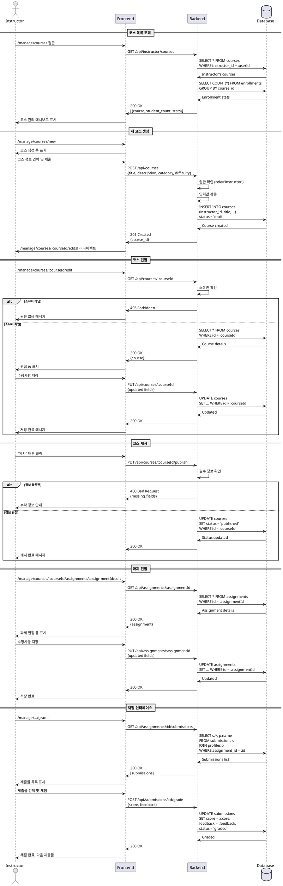

# 강사 코스 관리 유스케이스

## Primary Actor
강사 (Instructor 역할)

## Precondition
- 사용자가 Instructor 역할로 로그인함
- 프로필 정보가 완성됨

## Trigger
강사가 /manage 또는 /manage/courses 경로에 접근

## Main Scenario
1. 시스템이 강사의 코스 관리 대시보드를 표시함
   - 개설한 코스 목록
   - 코스별 상태 (draft/published/archived)
   - 수강생 수 및 제출물 통계
2. **새 코스 생성 시나리오:**
   - 강사가 "새 코스 만들기" 버튼 클릭 (/manage/courses/new)
   - 시스템이 코스 생성 폼 표시
   - 강사가 코스 정보 입력 (제목, 설명, 카테고리, 난이도)
   - 시스템이 코스를 draft 상태로 저장
   - 시스템이 코스 편집 페이지로 리다이렉트
3. **코스 편집 시나리오:**
   - 강사가 코스 선택 (/manage/courses/[courseId]/edit)
   - 시스템이 코스 상세 편집 폼 표시
   - 강사가 정보 수정
   - 시스템이 변경사항 저장
4. **코스 게시 시나리오:**
   - 강사가 draft 코스의 "게시" 버튼 클릭
   - 시스템이 필수 정보 확인
   - 시스템이 코스 상태를 published로 변경
   - 시스템이 학습자에게 코스 공개
5. **과제 관리 시나리오:**
   - 강사가 과제 관리 탭 선택
   - 시스템이 과제 목록 표시
   - 강사가 새 과제 생성 또는 기존 과제 편집
6. **채점 시나리오:**
   - 강사가 미채점 제출물 확인
   - 시스템이 채점 인터페이스로 이동
   - 강사가 점수 및 피드백 입력
   - 시스템이 채점 결과 저장

## Alternative Flows

### AF1: 코스 아카이브
1. 강사가 published 코스의 "아카이브" 버튼 클릭
2. 시스템이 확인 다이얼로그 표시
3. 강사가 확인
4. 시스템이 코스 상태를 archived로 변경
5. 시스템이 신규 수강신청 차단

### AF2: 일괄 채점
1. 강사가 과제의 제출물 목록에서 여러 제출물 선택
2. 강사가 "일괄 채점" 선택
3. 시스템이 일괄 채점 모달 표시
4. 강사가 공통 점수/피드백 입력
5. 시스템이 선택된 모든 제출물에 적용

## Edge Cases
- **E1: 필수 정보 누락으로 게시 불가**
  - 시스템이 누락된 필드 안내
  - 게시 버튼 비활성화 유지
- **E2: 수강생이 있는 코스 삭제 시도**
  - 시스템이 삭제 불가 안내
  - 아카이브 옵션만 제공
- **E3: 진행 중인 과제가 있는 코스 아카이브**
  - 시스템이 경고 메시지 표시
  - 과제 종료 후 아카이브 권장
- **E4: 동시 채점 충돌**
  - 시스템이 최신 버전 확인
  - 충돌 시 재로드 요청

## Business Rules
- Instructor 역할만 코스 생성 가능
- 코스 소유자만 편집/삭제 가능
- published 코스만 학습자에게 노출
- archived 코스는 읽기 전용
- 채점은 0-100 범위
- 재제출 허용 설정은 과제별로 관리

## Sequence Diagram



## UI Components

### 코스 관리 메인 (/manage)
- **통계 대시보드**
  - 총 개설 코스 수
  - 전체 수강생 수
  - 미채점 제출물 수
  - 이번 주 활동 요약
- **빠른 액세스 메뉴**
  - 새 코스 만들기
  - 미채점 제출물 보기
  - 최근 질문 확인

### 코스 목록 (/manage/courses)
- **코스 카드/테이블**
  - 코스 제목
  - 상태 뱃지 (draft/published/archived)
  - 수강생 수
  - 최근 활동
  - 관리 버튼 (편집/과제/통계)
- **필터 옵션**
  - 상태별
  - 카테고리별
- **액션 버튼**
  - 새 코스 만들기

### 코스 생성/편집 (/manage/courses/new, /manage/courses/[id]/edit)
- **기본 정보 섹션**
  - 코스 제목 (필수)
  - 설명 (필수)
  - 카테고리 선택
  - 난이도 선택
- **커리큘럼 관리**
  - 과제 목록
  - 과제 추가/편집/삭제
  - 순서 변경 (드래그 앤 드롭)
- **게시 설정**
  - 상태 변경 (draft/published/archived)
  - 게시 일정 설정 (optional)
- **저장 옵션**
  - 임시 저장
  - 저장 후 게시
  - 미리보기

### 과제 편집 (/manage/.../assignments/[id]/edit)
- **과제 정보**
  - 제목 (필수)
  - 설명
  - 마감일 설정
  - 가중치 설정
- **제출 정책**
  - 지각 제출 허용 여부
  - 재제출 허용 여부
  - 최대 제출 횟수
- **채점 기준**
  - 점수 범위
  - 루브릭 설정 (optional)

### 채점 인터페이스 (/manage/.../grade)
- **제출물 뷰어**
  - 제출 내용 표시
  - 제출 링크
  - 제출 시간
  - 지각 여부
- **채점 패널**
  - 점수 입력 (0-100)
  - 피드백 에디터
  - 재제출 요청 옵션
- **네비게이션**
  - 이전/다음 제출물
  - 제출물 목록으로 돌아가기
- **일괄 작업**
  - 일괄 채점
  - 피드백 템플릿

## API Endpoints

```
# 코스 관리
GET /api/instructor/courses - 강사의 코스 목록
POST /api/courses - 새 코스 생성
GET /api/courses/:id - 코스 상세 조회
PUT /api/courses/:id - 코스 정보 수정
PUT /api/courses/:id/publish - 코스 게시
PUT /api/courses/:id/archive - 코스 아카이브
DELETE /api/courses/:id - 코스 삭제 (draft만 가능)

# 과제 관리
GET /api/courses/:courseId/assignments - 과제 목록
POST /api/assignments - 새 과제 생성
GET /api/assignments/:id - 과제 상세
PUT /api/assignments/:id - 과제 수정
DELETE /api/assignments/:id - 과제 삭제

# 채점 관리
GET /api/assignments/:id/submissions - 제출물 목록
GET /api/submissions/:id - 제출물 상세
POST /api/submissions/:id/grade - 채점 처리
POST /api/submissions/batch-grade - 일괄 채점

# 통계
GET /api/instructor/dashboard - 대시보드 데이터
GET /api/courses/:id/analytics - 코스 분석
```

## Data Models

### Request: Create Course
```json
{
  "title": "string",
  "description": "string",
  "category": "string",
  "difficulty": "beginner|intermediate|advanced"
}
```

### Response: Instructor Dashboard
```json
{
  "stats": {
    "total_courses": 5,
    "total_students": 120,
    "pending_submissions": 15,
    "this_week_activities": 45
  },
  "recent_submissions": [...],
  "courses": [...]
}
```