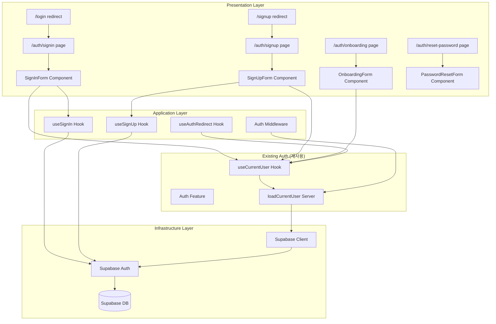

# 인증 페이지 정규화 모듈 설계 (수정본)

## 개요

### 모듈 목록 (기존 구조 활용)

| 모듈명 | 위치 | 설명 |
|--------|------|------|
| **기존 Auth Feature 활용** | `src/features/auth/` | 기존 인증 기능 활용 |
| Auth Server 확장 | `src/features/auth/server/` | 서버 인증 로직 확장 |
| Auth Hooks 활용 | `src/features/auth/hooks/` | 기존 useCurrentUser 활용 |
| **Auth Pages 정규화** | `src/app/auth/` | 정규화된 인증 페이지 |
| **리다이렉트 페이지** | `src/app/login/`, `src/app/signup/` | 레거시 경로 리다이렉트 |
| **Middleware 개선** | `src/middleware.ts` | Next.js 미들웨어 개선 |

## Diagram



## Implementation Plan

### 1. 기존 Auth 구조 활용 및 확장

#### 1.1 Auth Server Actions (`src/features/auth/server/auth-actions.ts`)
```typescript
// 신규 - 서버 액션으로 인증 로직 처리
'use server';

import { createSupabaseServerClient } from '@/lib/supabase/server-client';
import { redirect } from 'next/navigation';

export async function signIn(formData: FormData) {
  const email = formData.get('email') as string;
  const password = formData.get('password') as string;
  const redirectTo = formData.get('redirectTo') as string || '/dashboard';

  const supabase = await createSupabaseServerClient();

  const { data, error } = await supabase.auth.signInWithPassword({
    email,
    password,
  });

  if (error) {
    return { error: error.message };
  }

  // 프로필 완성 여부 확인
  const { data: profile } = await supabase
    .from('profiles')
    .select('name, phone, role')
    .eq('id', data.user.id)
    .single();

  if (!profile?.name || !profile?.phone || !profile?.role) {
    redirect('/auth/onboarding');
  }

  // 역할별 대시보드로 리다이렉트
  const dashboardUrl = profile.role === 'instructor'
    ? '/dashboard/instructor'
    : '/dashboard/learner';

  redirect(redirectTo === '/dashboard' ? dashboardUrl : redirectTo);
}

export async function signUp(formData: FormData) {
  const email = formData.get('email') as string;
  const password = formData.get('password') as string;

  const supabase = await createSupabaseServerClient();

  const { data, error } = await supabase.auth.signUp({
    email,
    password,
    options: {
      emailRedirectTo: `${process.env.NEXT_PUBLIC_SITE_URL}/auth/confirm`,
    },
  });

  if (error) {
    return { error: error.message };
  }

  if (data.user) {
    // 프로필 레코드 생성
    await supabase
      .from('profiles')
      .insert({
        id: data.user.id,
        email: data.user.email,
      });

    redirect('/auth/onboarding');
  }
}

export async function signOut() {
  const supabase = await createSupabaseServerClient();
  await supabase.auth.signOut();
  redirect('/auth/signin');
}

export async function resetPassword(email: string) {
  const supabase = await createSupabaseServerClient();

  const { error } = await supabase.auth.resetPasswordForEmail(email, {
    redirectTo: `${process.env.NEXT_PUBLIC_SITE_URL}/auth/reset-password`,
  });

  if (error) {
    return { error: error.message };
  }

  return { success: true };
}
```

#### 1.2 Enhanced Middleware (`src/middleware.ts`)
```typescript
import { NextResponse } from 'next/server';
import type { NextRequest } from 'next/server';
import { createSupabaseMiddlewareClient } from '@/lib/supabase/middleware-client';

export async function middleware(request: NextRequest) {
  const { pathname } = request.nextUrl;

  // 레거시 경로 리다이렉트
  if (pathname === '/login') {
    return NextResponse.redirect(new URL('/auth/signin', request.url));
  }
  if (pathname === '/signup') {
    return NextResponse.redirect(new URL('/auth/signup', request.url));
  }

  // Public routes
  const publicRoutes = [
    '/auth/signin',
    '/auth/signup',
    '/auth/reset-password',
    '/auth/confirm'
  ];
  const isPublicRoute = publicRoutes.some(route => pathname.startsWith(route));

  // Supabase 미들웨어 클라이언트로 세션 확인
  const supabase = createSupabaseMiddlewareClient(request);
  const { data: { session } } = await supabase.auth.getSession();

  // 보호된 경로 접근 시 로그인 필요
  if (!session && !isPublicRoute && !pathname.startsWith('/api')) {
    const url = new URL('/auth/signin', request.url);
    url.searchParams.set('redirectTo', pathname);
    return NextResponse.redirect(url);
  }

  // 로그인된 사용자가 인증 페이지 접근 시
  if (session && isPublicRoute) {
    // 프로필 확인
    const { data: profile } = await supabase
      .from('profiles')
      .select('role, name, phone')
      .eq('id', session.user.id)
      .single();

    // 프로필 미완성 시 온보딩으로
    if (!profile?.name || !profile?.phone || !profile?.role) {
      if (pathname !== '/auth/onboarding') {
        return NextResponse.redirect(new URL('/auth/onboarding', request.url));
      }
    } else {
      // 역할별 대시보드로 리다이렉트
      const dashboardUrl = profile.role === 'instructor'
        ? '/dashboard/instructor'
        : '/dashboard/learner';
      return NextResponse.redirect(new URL(dashboardUrl, request.url));
    }
  }

  return NextResponse.next();
}

export const config = {
  matcher: [
    '/((?!_next/static|_next/image|favicon.ico|.*\\.(?:svg|png|jpg|jpeg|gif|webp)$).*)',
  ],
};
```

### 2. Frontend Layer (기존 구조 활용)

#### 2.1 Sign In Page (`src/app/auth/signin/page.tsx`)
```typescript
'use client';

import { useCallback, useEffect, useState } from 'react';
import { useRouter, useSearchParams } from 'next/navigation';
import Link from 'next/link';
import { getSupabaseBrowserClient } from '@/lib/supabase/browser-client';
import { useCurrentUser } from '@/features/auth/hooks/useCurrentUser';
import { Button } from '@/components/ui/button';
import { Input } from '@/components/ui/input';
import { Card, CardContent, CardDescription, CardHeader, CardTitle } from '@/components/ui/card';

export default function SignInPage() {
  const router = useRouter();
  const searchParams = useSearchParams();
  const { refresh, isAuthenticated } = useCurrentUser();
  const [formState, setFormState] = useState({ email: '', password: '' });
  const [isSubmitting, setIsSubmitting] = useState(false);
  const [errorMessage, setErrorMessage] = useState<string | null>(null);

  const redirectTo = searchParams.get('redirectTo') || '/dashboard';

  useEffect(() => {
    if (isAuthenticated) {
      router.replace(redirectTo);
    }
  }, [isAuthenticated, router, redirectTo]);

  const handleSubmit = useCallback(
    async (e: React.FormEvent) => {
      e.preventDefault();
      setIsSubmitting(true);
      setErrorMessage(null);

      const supabase = getSupabaseBrowserClient();

      try {
        const { data, error } = await supabase.auth.signInWithPassword({
          email: formState.email,
          password: formState.password,
        });

        if (error) {
          setErrorMessage(error.message || '로그인에 실패했습니다.');
          return;
        }

        await refresh();

        // 프로필 확인
        const { data: profile } = await supabase
          .from('profiles')
          .select('name, phone, role')
          .eq('id', data.user.id)
          .single();

        if (!profile?.name || !profile?.phone || !profile?.role) {
          router.replace('/auth/onboarding');
        } else {
          const dashboardUrl = profile.role === 'instructor'
            ? '/dashboard/instructor'
            : '/dashboard/learner';
          router.replace(redirectTo === '/dashboard' ? dashboardUrl : redirectTo);
        }
      } finally {
        setIsSubmitting(false);
      }
    },
    [formState, refresh, router, redirectTo]
  );

  if (isAuthenticated) {
    return null;
  }

  return (
    <div className="min-h-screen flex items-center justify-center bg-muted/30">
      <Card className="w-full max-w-md">
        <CardHeader>
          <CardTitle>로그인</CardTitle>
          <CardDescription>
            LMS Platform에 로그인하여 학습을 계속하세요.
          </CardDescription>
        </CardHeader>
        <CardContent>
          <form onSubmit={handleSubmit} className="space-y-4">
            <div>
              <label htmlFor="email" className="block text-sm font-medium mb-1">
                이메일
              </label>
              <Input
                id="email"
                type="email"
                value={formState.email}
                onChange={(e) => setFormState(prev => ({ ...prev, email: e.target.value }))}
                required
                autoComplete="email"
                placeholder="email@example.com"
              />
            </div>

            <div>
              <label htmlFor="password" className="block text-sm font-medium mb-1">
                비밀번호
              </label>
              <Input
                id="password"
                type="password"
                value={formState.password}
                onChange={(e) => setFormState(prev => ({ ...prev, password: e.target.value }))}
                required
                autoComplete="current-password"
              />
            </div>

            {errorMessage && (
              <p className="text-sm text-destructive">{errorMessage}</p>
            )}

            <Button type="submit" className="w-full" disabled={isSubmitting}>
              {isSubmitting ? '로그인 중...' : '로그인'}
            </Button>
          </form>

          <div className="mt-4 text-center text-sm">
            <Link href="/auth/reset-password" className="text-primary hover:underline">
              비밀번호를 잊으셨나요?
            </Link>
          </div>

          <div className="mt-4 text-center text-sm">
            계정이 없으신가요?{' '}
            <Link href="/auth/signup" className="text-primary hover:underline">
              회원가입
            </Link>
          </div>
        </CardContent>
      </Card>
    </div>
  );
}
```

#### 2.2 Sign Up Page (`src/app/auth/signup/page.tsx`)
```typescript
'use client';

import { useCallback, useState } from 'react';
import { useRouter } from 'next/navigation';
import Link from 'next/link';
import { getSupabaseBrowserClient } from '@/lib/supabase/browser-client';
import { Button } from '@/components/ui/button';
import { Input } from '@/components/ui/input';
import { Card, CardContent, CardDescription, CardHeader, CardTitle } from '@/components/ui/card';

export default function SignUpPage() {
  const router = useRouter();
  const [formState, setFormState] = useState({
    email: '',
    password: '',
    passwordConfirm: ''
  });
  const [isSubmitting, setIsSubmitting] = useState(false);
  const [errorMessage, setErrorMessage] = useState<string | null>(null);

  const handleSubmit = useCallback(
    async (e: React.FormEvent) => {
      e.preventDefault();
      setIsSubmitting(true);
      setErrorMessage(null);

      if (formState.password !== formState.passwordConfirm) {
        setErrorMessage('비밀번호가 일치하지 않습니다.');
        setIsSubmitting(false);
        return;
      }

      const supabase = getSupabaseBrowserClient();

      try {
        const { data, error } = await supabase.auth.signUp({
          email: formState.email,
          password: formState.password,
        });

        if (error) {
          setErrorMessage(error.message || '회원가입에 실패했습니다.');
          return;
        }

        if (data.user) {
          // 프로필 레코드 생성
          await supabase
            .from('profiles')
            .insert({
              id: data.user.id,
              email: data.user.email,
            });

          router.push('/auth/onboarding');
        }
      } finally {
        setIsSubmitting(false);
      }
    },
    [formState, router]
  );

  return (
    <div className="min-h-screen flex items-center justify-center bg-muted/30">
      <Card className="w-full max-w-md">
        <CardHeader>
          <CardTitle>회원가입</CardTitle>
          <CardDescription>
            새 계정을 만들어 학습을 시작하세요.
          </CardDescription>
        </CardHeader>
        <CardContent>
          <form onSubmit={handleSubmit} className="space-y-4">
            <div>
              <label htmlFor="email" className="block text-sm font-medium mb-1">
                이메일
              </label>
              <Input
                id="email"
                type="email"
                value={formState.email}
                onChange={(e) => setFormState(prev => ({ ...prev, email: e.target.value }))}
                required
                autoComplete="email"
                placeholder="email@example.com"
              />
            </div>

            <div>
              <label htmlFor="password" className="block text-sm font-medium mb-1">
                비밀번호
              </label>
              <Input
                id="password"
                type="password"
                value={formState.password}
                onChange={(e) => setFormState(prev => ({ ...prev, password: e.target.value }))}
                required
                autoComplete="new-password"
                minLength={6}
              />
            </div>

            <div>
              <label htmlFor="passwordConfirm" className="block text-sm font-medium mb-1">
                비밀번호 확인
              </label>
              <Input
                id="passwordConfirm"
                type="password"
                value={formState.passwordConfirm}
                onChange={(e) => setFormState(prev => ({ ...prev, passwordConfirm: e.target.value }))}
                required
                autoComplete="new-password"
              />
            </div>

            {errorMessage && (
              <p className="text-sm text-destructive">{errorMessage}</p>
            )}

            <Button type="submit" className="w-full" disabled={isSubmitting}>
              {isSubmitting ? '가입 중...' : '회원가입'}
            </Button>
          </form>

          <div className="mt-4 text-center text-sm">
            이미 계정이 있으신가요?{' '}
            <Link href="/auth/signin" className="text-primary hover:underline">
              로그인
            </Link>
          </div>
        </CardContent>
      </Card>
    </div>
  );
}
```

#### 2.3 Onboarding Page (`src/app/auth/onboarding/page.tsx`)
```typescript
// 기존 onboarding 페이지 활용
// 이미 구현되어 있음
```

#### 2.4 Password Reset Page (`src/app/auth/reset-password/page.tsx`)
```typescript
'use client';

import { useState } from 'react';
import Link from 'next/link';
import { getSupabaseBrowserClient } from '@/lib/supabase/browser-client';
import { Button } from '@/components/ui/button';
import { Input } from '@/components/ui/input';
import { Card, CardContent, CardDescription, CardHeader, CardTitle } from '@/components/ui/card';

export default function ResetPasswordPage() {
  const [email, setEmail] = useState('');
  const [isSubmitting, setIsSubmitting] = useState(false);
  const [message, setMessage] = useState<{ type: 'success' | 'error'; text: string } | null>(null);

  const handleSubmit = async (e: React.FormEvent) => {
    e.preventDefault();
    setIsSubmitting(true);
    setMessage(null);

    const supabase = getSupabaseBrowserClient();

    const { error } = await supabase.auth.resetPasswordForEmail(email, {
      redirectTo: `${window.location.origin}/auth/reset-password`,
    });

    if (error) {
      setMessage({ type: 'error', text: error.message });
    } else {
      setMessage({
        type: 'success',
        text: '비밀번호 재설정 링크를 이메일로 전송했습니다.'
      });
    }

    setIsSubmitting(false);
  };

  return (
    <div className="min-h-screen flex items-center justify-center bg-muted/30">
      <Card className="w-full max-w-md">
        <CardHeader>
          <CardTitle>비밀번호 재설정</CardTitle>
          <CardDescription>
            가입하신 이메일로 재설정 링크를 보내드립니다.
          </CardDescription>
        </CardHeader>
        <CardContent>
          <form onSubmit={handleSubmit} className="space-y-4">
            <div>
              <label htmlFor="email" className="block text-sm font-medium mb-1">
                이메일
              </label>
              <Input
                id="email"
                type="email"
                value={email}
                onChange={(e) => setEmail(e.target.value)}
                required
                placeholder="email@example.com"
              />
            </div>

            {message && (
              <p className={`text-sm ${message.type === 'error' ? 'text-destructive' : 'text-green-600'}`}>
                {message.text}
              </p>
            )}

            <Button type="submit" className="w-full" disabled={isSubmitting}>
              {isSubmitting ? '전송 중...' : '재설정 링크 보내기'}
            </Button>
          </form>

          <div className="mt-4 text-center text-sm">
            <Link href="/auth/signin" className="text-primary hover:underline">
              로그인으로 돌아가기
            </Link>
          </div>
        </CardContent>
      </Card>
    </div>
  );
}
```

#### 2.5 레거시 경로 리다이렉트
```typescript
// src/app/login/page.tsx는 이미 존재하므로 수정
// 단순 리다이렉트로 변경
import { redirect } from 'next/navigation';

export default function LoginPage() {
  redirect('/auth/signin');
}

// src/app/signup/page.tsx도 동일하게 수정
import { redirect } from 'next/navigation';

export default function SignupPage() {
  redirect('/auth/signup');
}
```

### 3. Hooks (기존 활용)

#### 3.1 useAuthRedirect Hook (`src/features/auth/hooks/useAuthRedirect.ts`)
```typescript
// 신규 - 인증 리다이렉트 로직
import { useEffect } from 'react';
import { useRouter, usePathname } from 'next/navigation';
import { useCurrentUser } from './useCurrentUser';

export const useAuthRedirect = () => {
  const { user, isAuthenticated } = useCurrentUser();
  const router = useRouter();
  const pathname = usePathname();

  useEffect(() => {
    const publicRoutes = ['/auth/signin', '/auth/signup', '/auth/reset-password'];
    const isPublicRoute = publicRoutes.includes(pathname);

    if (!isAuthenticated && !isPublicRoute) {
      router.push(`/auth/signin?redirectTo=${pathname}`);
    }

    if (isAuthenticated && isPublicRoute) {
      // 프로필에서 역할 확인 후 리다이렉트
      if (user?.userMetadata?.role === 'instructor') {
        router.push('/dashboard/instructor');
      } else {
        router.push('/dashboard/learner');
      }
    }
  }, [isAuthenticated, pathname, router, user]);
};
```

### 4. API Routes 정리 (IA 문서와 완전 일치)

```typescript
// IA 문서 기준 페이지 라우트
/auth/signin                    // 로그인 페이지 (신규)
/auth/signup                    // 회원가입 페이지 (신규)
/auth/onboarding                // 온보딩 페이지 (기존)
/auth/reset-password            // 비밀번호 재설정 (신규)

// 레거시 경로 리다이렉트
/login → /auth/signin           // 리다이렉트
/signup → /auth/signup          // 리다이렉트
```

### 5. Testing Strategy

#### Frontend Tests
```typescript
// src/app/auth/__tests__/signin.test.tsx
describe('SignIn Page', () => {
  it('should redirect legacy /login route');
  it('should validate email format');
  it('should handle login errors');
  it('should redirect after successful login');
  it('should preserve redirectTo parameter');
});

// src/app/auth/__tests__/signup.test.tsx
describe('SignUp Page', () => {
  it('should redirect legacy /signup route');
  it('should validate password match');
  it('should handle duplicate email');
  it('should redirect to onboarding after signup');
});
```

### 6. 기존 코드와의 통합 포인트

1. **useCurrentUser**: 기존 훅 그대로 활용
2. **loadCurrentUser**: 기존 서버 함수 활용
3. **Supabase Client**: 기존 클라이언트 설정 활용
4. **Onboarding**: 기존 온보딩 페이지 활용
5. **Profiles**: 기존 profiles 테이블 구조 활용

이 설계는 기존 auth 구조를 최대한 활용하면서 IA 문서의 라우트 구조를 완벽히 따릅니다.