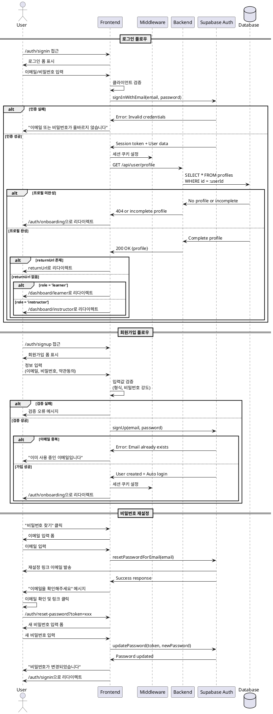

# 인증 페이지 정규화 유스케이스

## Primary Actor
미인증 사용자 또는 신규 사용자

## Precondition
- 사용자가 시스템에 접근
- 로그인이 필요한 페이지에 접근 시도 또는 회원가입 필요

## Trigger
- 사용자가 /auth/signin 또는 /auth/signup 경로에 접근
- 보호된 페이지 접근 시 자동 리다이렉트

## Main Scenario

### 로그인 시나리오 (/auth/signin)
1. 시스템이 로그인 폼을 표시함
   - 이메일 입력 필드
   - 비밀번호 입력 필드
   - "로그인 유지" 체크박스
2. 사용자가 인증 정보 입력
3. 시스템이 입력값 검증
4. 시스템이 Supabase Auth로 인증 요청
5. 인증 성공 시:
   - 세션 쿠키 설정
   - 프로필 완성 여부 확인
   - 적절한 페이지로 리다이렉트
6. 사용자가 원래 요청한 페이지 또는 대시보드로 이동

### 회원가입 시나리오 (/auth/signup)
1. 시스템이 회원가입 폼을 표시함
   - 이메일 입력 필드
   - 비밀번호 입력 필드
   - 비밀번호 확인 필드
   - 약관 동의 체크박스
2. 사용자가 회원가입 정보 입력
3. 시스템이 입력값 검증
   - 이메일 형식 확인
   - 비밀번호 강도 확인
   - 비밀번호 일치 확인
4. 시스템이 Supabase Auth로 계정 생성 요청
5. 계정 생성 성공 시:
   - 자동 로그인 처리
   - 온보딩 페이지로 리다이렉트
6. 사용자가 역할 선택 및 프로필 완성 진행

## Alternative Flows

### AF1: 비밀번호 재설정
1. 사용자가 "비밀번호를 잊으셨나요?" 링크 클릭
2. 시스템이 이메일 입력 폼 표시
3. 사용자가 이메일 입력
4. 시스템이 비밀번호 재설정 링크 발송
5. 사용자가 이메일 확인 후 재설정 진행

### AF2: 소셜 로그인 (Optional)
1. 사용자가 소셜 로그인 버튼 클릭 (Google/GitHub)
2. 시스템이 OAuth 제공자로 리다이렉트
3. 사용자가 권한 승인
4. 시스템이 콜백 처리
5. 신규 사용자면 온보딩으로, 기존 사용자면 대시보드로 이동

## Edge Cases
- **E1: 이미 로그인된 사용자**
  - 시스템이 대시보드로 자동 리다이렉트
- **E2: 잘못된 인증 정보**
  - 시스템이 에러 메시지 표시
  - 3회 실패 시 일시적 잠금 (optional)
- **E3: 이미 존재하는 이메일로 가입 시도**
  - 시스템이 "이미 사용 중인 이메일" 메시지 표시
- **E4: 약한 비밀번호**
  - 시스템이 비밀번호 강도 요구사항 표시
- **E5: 네트워크 오류**
  - 시스템이 재시도 옵션과 함께 에러 메시지 표시
- **E6: 이메일 인증 필요 (optional)**
  - 시스템이 이메일 인증 안내 메시지 표시

## Business Rules
- 비밀번호는 최소 8자, 대소문자, 숫자, 특수문자 포함
- 이메일은 유효한 형식이어야 함
- 약관 동의는 필수
- 세션은 기본 24시간, "로그인 유지" 선택 시 30일
- 인증 실패는 로그에 기록
- 회원가입 후 반드시 온보딩 완료 필요

## Sequence Diagram



## UI Components

### 로그인 페이지 (/auth/signin)
- **헤더**
  - 로고
  - "회원이 아니신가요?" 링크
- **로그인 폼**
  - 이메일 입력 필드
  - 비밀번호 입력 필드
  - "로그인 유지" 체크박스
  - "로그인" 버튼
- **추가 옵션**
  - "비밀번호를 잊으셨나요?" 링크
  - 소셜 로그인 버튼 (optional)
- **에러 메시지 영역**
  - 인증 실패 메시지
  - 계정 잠금 안내

### 회원가입 페이지 (/auth/signup)
- **헤더**
  - 로고
  - "이미 계정이 있으신가요?" 링크
- **회원가입 폼**
  - 이메일 입력 필드
  - 비밀번호 입력 필드
  - 비밀번호 확인 필드
  - 비밀번호 강도 표시기
  - 약관 동의 체크박스
  - "회원가입" 버튼
- **약관 링크**
  - 이용약관 보기
  - 개인정보처리방침 보기
- **소셜 가입 옵션** (optional)

### 비밀번호 재설정 페이지
- **이메일 입력 단계**
  - 안내 메시지
  - 이메일 입력 필드
  - "재설정 링크 보내기" 버튼
- **새 비밀번호 입력 단계**
  - 새 비밀번호 필드
  - 비밀번호 확인 필드
  - 비밀번호 강도 표시
  - "비밀번호 변경" 버튼

## API Endpoints

```
# 인증 관련 (Supabase Auth 사용)
POST /auth/v1/signup - 회원가입
POST /auth/v1/token?grant_type=password - 로그인
POST /auth/v1/logout - 로그아웃
POST /auth/v1/recover - 비밀번호 재설정 요청
PUT /auth/v1/user - 비밀번호 변경

# 프로필 확인
GET /api/user/profile - 프로필 완성 여부 확인
GET /api/auth/session - 세션 상태 확인
```

## 보안 고려사항

- HTTPS 필수
- CSRF 토큰 사용
- Rate limiting 적용 (로그인 시도 제한)
- 비밀번호는 bcrypt로 해시
- 세션 탈취 방지 (secure, httpOnly, sameSite 쿠키)
- SQL Injection 방지 (prepared statements)
- XSS 방지 (입력값 sanitization)

## 디자인 요구사항

- 모바일 반응형
- 접근성 준수 (ARIA labels, 키보드 네비게이션)
- 로딩 상태 표시
- 폼 검증 실시간 피드백
- 브랜딩 일관성