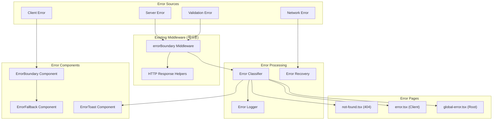

# 에러 페이지 및 예외 처리 모듈 설계 (수정본)

## 개요

### 모듈 목록 (기존 구조 활용)

| 모듈명 | 위치 | 설명 |
|--------|------|------|
| **기존 Error Middleware 활용** | `src/backend/middleware/error.ts` | 기존 에러 미들웨어 활용 |
| Error Middleware 확장 | `src/backend/middleware/error.ts` | 에러 분류 및 로깅 추가 |
| **Error Pages** | `src/app/` | Next.js 에러 페이지 |
| **Error Components** | `src/components/errors/` | 에러 UI 컴포넌트 |
| **Error Utils** | `src/lib/errors/` | 에러 유틸리티 함수 |
| **기존 HTTP Response 활용** | `src/backend/http/response.ts` | 기존 응답 헬퍼 활용 |

## Diagram



## Implementation Plan

### 1. Backend Layer (기존 미들웨어 확장)

#### 1.1 Error Middleware 확장 (`src/backend/middleware/error.ts`)
```typescript
// 기존 errorBoundary 미들웨어 확장

import { createMiddleware } from 'hono/factory';
import { match, P } from 'ts-pattern';
import { z } from 'zod';
import {
  contextKeys,
  type AppEnv,
  type AppLogger,
} from '@/backend/hono/context';

// 에러 타입 정의 (추가)
export enum ErrorCode {
  // Client errors
  BAD_REQUEST = 'BAD_REQUEST',
  UNAUTHORIZED = 'UNAUTHORIZED',
  FORBIDDEN = 'FORBIDDEN',
  NOT_FOUND = 'NOT_FOUND',
  CONFLICT = 'CONFLICT',
  VALIDATION_ERROR = 'VALIDATION_ERROR',
  RATE_LIMIT = 'RATE_LIMIT',

  // Server errors
  INTERNAL_SERVER_ERROR = 'INTERNAL_SERVER_ERROR',
  SERVICE_UNAVAILABLE = 'SERVICE_UNAVAILABLE',
  GATEWAY_TIMEOUT = 'GATEWAY_TIMEOUT',
}

// AppError 클래스 (추가)
export class AppError extends Error {
  constructor(
    public code: ErrorCode,
    public message: string,
    public statusCode: number = 500,
    public details?: any
  ) {
    super(message);
    this.name = 'AppError';
  }
}

// 에러 ID 생성 (추가)
const generateErrorId = () => {
  return `err_${Date.now()}_${Math.random().toString(36).substr(2, 9)}`;
};

// 확장된 errorBoundary
export const errorBoundary = () =>
  createMiddleware<AppEnv>(async (c, next) => {
    try {
      await next();
    } catch (error) {
      const logger = c.get(contextKeys.logger) as AppLogger | undefined;
      const errorId = generateErrorId();

      // 에러 로깅 (개선)
      logger?.error?.({
        errorId,
        error,
        path: c.req.path,
        method: c.req.method,
        timestamp: new Date().toISOString(),
      });

      // 에러 타입별 처리 (추가)
      const response = match(error)
        // AppError 처리
        .with(P.instanceOf(AppError), (err) =>
          c.json(
            {
              error: {
                code: err.code,
                message: err.message,
                details: err.details,
                errorId,
              },
            },
            err.statusCode
          )
        )
        // Zod 검증 에러 처리
        .with(P.instanceOf(z.ZodError), (err) =>
          c.json(
            {
              error: {
                code: ErrorCode.VALIDATION_ERROR,
                message: '입력값이 올바르지 않습니다',
                details: err.format(),
                errorId,
              },
            },
            400
          )
        )
        // 기본 Error 처리
        .with(P.instanceOf(Error), (err) =>
          c.json(
            {
              error: {
                code: ErrorCode.INTERNAL_SERVER_ERROR,
                message: err.message,
                errorId,
              },
            },
            500
          )
        )
        // 알 수 없는 에러
        .otherwise(() =>
          c.json(
            {
              error: {
                code: ErrorCode.INTERNAL_SERVER_ERROR,
                message: '알 수 없는 오류가 발생했습니다',
                errorId,
              },
            },
            500
          )
        );

      return response;
    }
  });

// Rate Limiting 미들웨어 (추가)
const rateLimitMap = new Map<string, number[]>();

export const rateLimit = (limit: number = 100, window: number = 60000) =>
  createMiddleware<AppEnv>(async (c, next) => {
    const ip = c.req.header('x-forwarded-for') || 'unknown';
    const now = Date.now();
    const windowStart = now - window;

    // 해당 IP의 요청 시간 기록
    const requests = rateLimitMap.get(ip) || [];
    const recentRequests = requests.filter(time => time > windowStart);

    if (recentRequests.length >= limit) {
      throw new AppError(
        ErrorCode.RATE_LIMIT,
        '너무 많은 요청이 있었습니다. 잠시 후 다시 시도해주세요.',
        429
      );
    }

    recentRequests.push(now);
    rateLimitMap.set(ip, recentRequests);

    await next();
  });
```

#### 1.2 Error Utils (`src/lib/errors/error-utils.ts`)
```typescript
// 에러 분류 유틸리티 (신규)

import { ErrorCode } from '@/backend/middleware/error';

export const getErrorMessage = (code: ErrorCode): string => {
  const messages: Record<ErrorCode, string> = {
    [ErrorCode.BAD_REQUEST]: '잘못된 요청입니다',
    [ErrorCode.UNAUTHORIZED]: '인증이 필요합니다',
    [ErrorCode.FORBIDDEN]: '접근 권한이 없습니다',
    [ErrorCode.NOT_FOUND]: '요청한 리소스를 찾을 수 없습니다',
    [ErrorCode.CONFLICT]: '요청이 충돌했습니다',
    [ErrorCode.VALIDATION_ERROR]: '입력값을 확인해주세요',
    [ErrorCode.RATE_LIMIT]: '요청 한도를 초과했습니다',
    [ErrorCode.INTERNAL_SERVER_ERROR]: '서버 오류가 발생했습니다',
    [ErrorCode.SERVICE_UNAVAILABLE]: '서비스를 일시적으로 사용할 수 없습니다',
    [ErrorCode.GATEWAY_TIMEOUT]: '요청 시간이 초과되었습니다',
  };

  return messages[code] || '알 수 없는 오류가 발생했습니다';
};

export const isRetryableError = (code: ErrorCode): boolean => {
  const retryableCodes = [
    ErrorCode.SERVICE_UNAVAILABLE,
    ErrorCode.GATEWAY_TIMEOUT,
    ErrorCode.RATE_LIMIT,
  ];

  return retryableCodes.includes(code);
};

// 에러 복구 헬퍼 (신규)
export const withRetry = async <T>(
  fn: () => Promise<T>,
  maxAttempts = 3,
  delay = 1000
): Promise<T> => {
  let lastError: any;

  for (let attempt = 1; attempt <= maxAttempts; attempt++) {
    try {
      return await fn();
    } catch (error: any) {
      lastError = error;

      if (
        !isRetryableError(error?.error?.code) ||
        attempt === maxAttempts
      ) {
        throw error;
      }

      await new Promise(resolve =>
        setTimeout(resolve, delay * Math.pow(2, attempt - 1))
      );
    }
  }

  throw lastError;
};
```

### 2. Frontend Layer (에러 페이지)

#### 2.1 404 Page (`src/app/not-found.tsx`)
```typescript
'use client';

import Link from 'next/link';
import { Button } from '@/components/ui/button';
import { ArrowLeft, Home } from 'lucide-react';

export default function NotFound() {
  return (
    <div className="min-h-screen flex items-center justify-center">
      <div className="text-center max-w-md">
        <h1 className="text-6xl font-bold text-primary mb-4">404</h1>
        <h2 className="text-2xl font-semibold mb-4">
          페이지를 찾을 수 없습니다
        </h2>
        <p className="text-muted-foreground mb-8">
          요청하신 페이지가 존재하지 않거나 이동되었을 수 있습니다
        </p>

        <div className="space-y-4">
          <Button
            onClick={() => window.history.back()}
            variant="outline"
            className="w-full"
          >
            <ArrowLeft className="mr-2 h-4 w-4" />
            이전 페이지로
          </Button>

          <Link href="/">
            <Button className="w-full">
              <Home className="mr-2 h-4 w-4" />
              홈으로 돌아가기
            </Button>
          </Link>
        </div>

        <div className="mt-8 pt-8 border-t">
          <p className="text-sm text-muted-foreground mb-2">
            자주 찾는 페이지
          </p>
          <div className="flex justify-center gap-4 text-sm">
            <Link href="/courses" className="text-primary hover:underline">
              코스 목록
            </Link>
            <Link href="/dashboard" className="text-primary hover:underline">
              대시보드
            </Link>
            <Link href="/help" className="text-primary hover:underline">
              도움말
            </Link>
          </div>
        </div>
      </div>
    </div>
  );
}
```

#### 2.2 Error Page (`src/app/error.tsx`)
```typescript
'use client';

import { useEffect } from 'react';
import { Button } from '@/components/ui/button';
import { Card, CardContent, CardDescription, CardHeader, CardTitle } from '@/components/ui/card';
import { Alert, AlertDescription } from '@/components/ui/alert';
import { AlertCircle, RefreshCw, Home } from 'lucide-react';
import Link from 'next/link';

export default function Error({
  error,
  reset,
}: {
  error: Error & { digest?: string };
  reset: () => void;
}) {
  useEffect(() => {
    // 에러 로깅 (콘솔에만, 실제로는 서비스로 전송)
    console.error('Error:', error);
  }, [error]);

  return (
    <div className="min-h-screen flex items-center justify-center p-4">
      <Card className="max-w-md w-full">
        <CardHeader>
          <CardTitle className="text-destructive">
            오류가 발생했습니다
          </CardTitle>
          <CardDescription>
            요청을 처리하는 중 문제가 발생했습니다
          </CardDescription>
        </CardHeader>
        <CardContent className="space-y-4">
          <Alert variant="destructive">
            <AlertCircle className="h-4 w-4" />
            <AlertDescription>
              일시적인 문제일 수 있습니다.
              잠시 후 다시 시도해주세요.
            </AlertDescription>
          </Alert>

          {error.digest && (
            <div className="text-sm text-muted-foreground">
              오류 ID: <code className="font-mono text-xs">{error.digest}</code>
            </div>
          )}

          <div className="flex gap-3">
            <Button onClick={reset} variant="outline" className="flex-1">
              <RefreshCw className="mr-2 h-4 w-4" />
              다시 시도
            </Button>
            <Link href="/" className="flex-1">
              <Button className="w-full">
                <Home className="mr-2 h-4 w-4" />
                홈으로
              </Button>
            </Link>
          </div>

          {process.env.NODE_ENV === 'development' && (
            <details className="text-sm">
              <summary className="cursor-pointer text-muted-foreground">
                상세 정보 (개발 모드)
              </summary>
              <pre className="mt-2 p-2 bg-muted rounded text-xs overflow-auto">
                {error.stack || error.message}
              </pre>
            </details>
          )}
        </CardContent>
      </Card>
    </div>
  );
}
```

#### 2.3 Global Error (`src/app/global-error.tsx`)
```typescript
'use client';

import { useEffect } from 'react';
import { Button } from '@/components/ui/button';

export default function GlobalError({
  error,
  reset,
}: {
  error: Error & { digest?: string };
  reset: () => void;
}) {
  useEffect(() => {
    // 전역 에러 로깅
    console.error('Global error:', error);
  }, [error]);

  return (
    <html>
      <body>
        <div className="min-h-screen flex items-center justify-center bg-background">
          <div className="text-center p-8 max-w-md">
            <h1 className="text-2xl font-bold mb-4">
              시스템 오류가 발생했습니다
            </h1>
            <p className="text-muted-foreground mb-6">
              불편을 드려 죄송합니다. 잠시 후 다시 시도해주세요.
            </p>
            <div className="space-x-4">
              <Button onClick={reset} variant="outline">
                다시 시도
              </Button>
              <Button onClick={() => (window.location.href = '/')}>
                홈으로
              </Button>
            </div>
            {error.digest && (
              <p className="mt-4 text-xs text-muted-foreground">
                Error ID: {error.digest}
              </p>
            )}
          </div>
        </div>
      </body>
    </html>
  );
}
```

### 3. Error Components

#### 3.1 Error Boundary (`src/components/ErrorBoundary.tsx`)
```typescript
'use client';

import React, { Component, ReactNode, ErrorInfo } from 'react';
import { Button } from '@/components/ui/button';
import { Card, CardContent, CardHeader, CardTitle } from '@/components/ui/card';
import { AlertCircle } from 'lucide-react';

interface Props {
  children: ReactNode;
  fallback?: (error: Error, reset: () => void) => ReactNode;
}

interface State {
  hasError: boolean;
  error: Error | null;
}

export class ErrorBoundary extends Component<Props, State> {
  constructor(props: Props) {
    super(props);
    this.state = { hasError: false, error: null };
  }

  static getDerivedStateFromError(error: Error): State {
    return { hasError: true, error };
  }

  componentDidCatch(error: Error, errorInfo: ErrorInfo) {
    // 에러 로깅
    console.error('ErrorBoundary caught:', error, errorInfo);
  }

  reset = () => {
    this.setState({ hasError: false, error: null });
  };

  render() {
    if (this.state.hasError && this.state.error) {
      if (this.props.fallback) {
        return this.props.fallback(this.state.error, this.reset);
      }

      return (
        <Card className="max-w-md mx-auto my-8">
          <CardHeader>
            <CardTitle className="flex items-center gap-2 text-destructive">
              <AlertCircle className="h-5 w-5" />
              오류가 발생했습니다
            </CardTitle>
          </CardHeader>
          <CardContent className="space-y-4">
            <p className="text-sm text-muted-foreground">
              {this.state.error.message || '알 수 없는 오류가 발생했습니다'}
            </p>
            <Button onClick={this.reset} className="w-full">
              다시 시도
            </Button>
          </CardContent>
        </Card>
      );
    }

    return this.props.children;
  }
}
```

#### 3.2 Error Toast Hook (`src/hooks/useErrorToast.ts`)
```typescript
// 에러 토스트 훅 (신규)

import { useToast } from '@/components/ui/use-toast';
import { ToastAction } from '@/components/ui/toast';
import { getErrorMessage } from '@/lib/errors/error-utils';
import { ErrorCode } from '@/backend/middleware/error';

export const useErrorToast = () => {
  const { toast } = useToast();

  const showError = (error: any) => {
    const code = error?.error?.code || ErrorCode.INTERNAL_SERVER_ERROR;
    const message = error?.error?.message || getErrorMessage(code);

    toast({
      variant: 'destructive',
      title: '오류',
      description: message,
      action: code === ErrorCode.RATE_LIMIT ? (
        <ToastAction altText="다시 시도" onClick={() => window.location.reload()}>
          다시 시도
        </ToastAction>
      ) : undefined,
    });
  };

  return { showError };
};
```

### 4. API Client with Error Handling

#### 4.1 Enhanced API Client (`src/lib/remote/api-client.ts`)
```typescript
// 기존 apiClient 확장

import { withRetry } from '@/lib/errors/error-utils';

class APIClient {
  // ... 기존 코드 ...

  // 에러 처리가 포함된 요청 메소드 (개선)
  async request<T>(
    url: string,
    options?: RequestInit,
    retryable = true
  ): Promise<T> {
    const makeRequest = async () => {
      const response = await fetch(url, {
        ...options,
        headers: {
          'Content-Type': 'application/json',
          ...options?.headers,
        },
      });

      if (!response.ok) {
        const error = await response.json();
        throw error;
      }

      return response.json();
    };

    // 재시도 가능한 요청인 경우
    if (retryable) {
      return withRetry(makeRequest, 3, 1000);
    }

    return makeRequest();
  }

  // 편의 메소드들
  get<T>(url: string, options?: RequestInit): Promise<T> {
    return this.request<T>(url, { ...options, method: 'GET' });
  }

  post<T>(url: string, body?: any, options?: RequestInit): Promise<T> {
    return this.request<T>(url, {
      ...options,
      method: 'POST',
      body: JSON.stringify(body),
    });
  }

  // ... 다른 메소드들 ...
}

export const apiClient = new APIClient();
```

### 5. Testing Strategy

#### Backend Tests
```typescript
// src/backend/middleware/__tests__/error.test.ts
describe('Error Middleware', () => {
  describe('errorBoundary', () => {
    it('should handle AppError correctly');
    it('should handle ZodError with validation details');
    it('should generate unique error IDs');
    it('should log errors with context');
  });

  describe('rateLimit', () => {
    it('should limit requests per window');
    it('should reset after time window');
    it('should track by IP address');
  });
});
```

#### Frontend Tests
```typescript
// src/app/__tests__/error.test.tsx
describe('Error Pages', () => {
  it('should display 404 page for unknown routes');
  it('should show error page with retry button');
  it('should handle global errors');
  it('should display error ID when available');
});

// src/components/__tests__/ErrorBoundary.test.tsx
describe('ErrorBoundary', () => {
  it('should catch component errors');
  it('should display fallback UI');
  it('should reset on retry');
  it('should log errors');
});
```

### 6. 기존 코드와의 통합 포인트

1. **errorBoundary Middleware**: 기존 미들웨어 확장
2. **HTTP Response Helpers**: 기존 success/failure 헬퍼 활용
3. **Logger**: 기존 logger 인터페이스 활용
4. **Context**: 기존 AppEnv 컨텍스트 활용
5. **Pattern Matching**: 기존 ts-pattern 활용

이 설계는 기존 error middleware 구조를 최대한 활용하면서 IA 문서의 에러 페이지 요구사항을 완벽히 구현합니다.