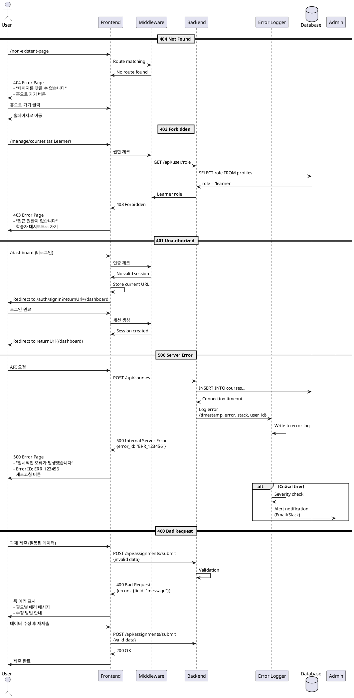

# 에러 페이지 및 예외 처리 유스케이스

## Primary Actor
시스템 사용자 (모든 역할)

## Precondition
- 사용자가 시스템을 사용 중
- 예상치 못한 상황 발생

## Trigger
- 존재하지 않는 페이지 접근 (404)
- 권한 없는 리소스 접근 (403)
- 인증되지 않은 상태로 보호된 페이지 접근 (401)
- 서버 오류 발생 (500)
- 잘못된 요청 (400)

## Main Scenarios

### 404 Not Found
1. 사용자가 존재하지 않는 URL에 접근
2. 시스템이 404 에러 페이지 표시
   - 친근한 에러 메시지
   - 홈페이지로 돌아가기 버튼
   - 검색 기능 제공
   - 추천 페이지 링크
3. 사용자가 제공된 옵션 중 하나 선택
4. 시스템이 해당 페이지로 이동

### 403 Forbidden
1. 사용자가 권한 없는 리소스에 접근 시도
   - Learner가 Instructor 페이지 접근
   - 타인의 제출물 접근 시도
2. 시스템이 403 에러 페이지 표시
   - 접근 권한 없음 안내
   - 역할별 적절한 대안 제시
3. 사용자가 자신의 권한에 맞는 페이지로 이동

### 401 Unauthorized
1. 비로그인 사용자가 보호된 페이지 접근
2. 시스템이 401 처리
   - 로그인 페이지로 자동 리다이렉트
   - 원래 요청 URL 저장 (returnUrl)
3. 로그인 후 원래 페이지로 자동 이동

### 500 Internal Server Error
1. 서버 처리 중 예외 발생
2. 시스템이 500 에러 페이지 표시
   - 일반적인 오류 메시지 (보안상 상세 정보 숨김)
   - 오류 ID/코드 표시
   - 지원팀 연락 방법
   - 새로고침 또는 홈으로 가기 옵션
3. 시스템이 오류 로그 자동 기록
4. 관리자에게 알림 발송 (critical error의 경우)

### 400 Bad Request
1. 사용자가 잘못된 데이터로 요청
   - 유효하지 않은 파라미터
   - 필수 필드 누락
2. 시스템이 구체적인 오류 메시지 반환
   - 어떤 필드가 문제인지 명시
   - 올바른 형식 안내
3. 사용자가 입력값 수정 후 재시도

## Alternative Flows

### AF1: 자동 복구 가능한 오류
1. 시스템이 일시적 오류 감지 (네트워크, DB 연결 등)
2. 자동 재시도 (최대 3회)
3. 성공 시 정상 처리 계속
4. 실패 시 사용자에게 오류 표시

### AF2: 세션 만료
1. 사용자의 세션이 만료됨
2. 시스템이 세션 만료 모달 표시
3. "다시 로그인" 또는 "홈으로" 선택
4. 다시 로그인 시 이전 작업 복구 시도

## Edge Cases
- **E1: 연속적인 오류 발생**
  - Rate limiting 적용
  - 일정 횟수 초과 시 일시적 차단
- **E2: 오류 페이지 자체 오류**
  - 최소한의 정적 HTML 페이지로 폴백
- **E3: 악의적 접근 시도**
  - 보안 로그 기록
  - IP 차단 고려
- **E4: 대량 404 발생**
  - 봇 공격 가능성 체크
  - CDN/WAF 규칙 적용

## Business Rules
- 보안 정보는 절대 노출하지 않음
- 모든 오류는 로그에 기록
- 사용자 친화적 메시지 제공
- 브랜딩 일관성 유지
- 오류 페이지도 반응형 디자인
- 접근성 준수

## Sequence Diagram



## UI Components

### 404 Page
- **헤더**
  - 로고 (홈 링크)
  - 기본 네비게이션
- **메인 콘텐츠**
  - 큰 404 숫자 또는 일러스트
  - "페이지를 찾을 수 없습니다" 제목
  - "요청하신 페이지가 존재하지 않거나 이동되었을 수 있습니다" 설명
- **액션 옵션**
  - "홈으로 돌아가기" 버튼
  - 검색 바
  - 인기 페이지 링크
    - 코스 목록
    - 내 코스
    - 대시보드
- **푸터**
  - 고객 지원 링크

### 403 Page
- **헤더**
  - 로고
  - 사용자 정보
- **메인 콘텐츠**
  - 자물쇠 아이콘
  - "접근 권한이 없습니다" 제목
  - 역할별 맞춤 메시지
- **액션 옵션**
  - 역할에 맞는 대시보드로 가기
  - 이전 페이지로 돌아가기
  - 권한 요청 (optional)

### 500 Page
- **메인 콘텐츠**
  - 오류 일러스트
  - "일시적인 오류가 발생했습니다" 제목
  - "잠시 후 다시 시도해주세요" 설명
  - Error ID 표시
- **액션 옵션**
  - "새로고침" 버튼
  - "홈으로" 버튼
  - "지원팀 문의" 링크
- **추가 정보**
  - 예상 복구 시간 (있을 경우)
  - 시스템 상태 페이지 링크

### 세션 만료 모달
- **콘텐츠**
  - "세션이 만료되었습니다" 제목
  - "보안을 위해 자동으로 로그아웃되었습니다" 설명
- **버튼**
  - "다시 로그인" (primary)
  - "홈으로" (secondary)

## Error Tracking

### 로그 포맷
```json
{
  "timestamp": "2025-01-10T10:30:00Z",
  "level": "ERROR",
  "error_id": "ERR_123456",
  "user_id": "uuid",
  "session_id": "session_uuid",
  "request": {
    "method": "POST",
    "url": "/api/courses",
    "headers": {...},
    "body": {...}
  },
  "error": {
    "message": "Database connection timeout",
    "stack": "...",
    "code": "ECONNREFUSED"
  },
  "context": {
    "service": "course-service",
    "version": "1.0.0"
  }
}
```

### 모니터링 메트릭
- 에러율 (4xx, 5xx)
- 응답 시간
- 에러 타입별 분포
- 사용자별 에러 빈도
- 페이지별 404 통계

## API Error Response Format

```json
{
  "error": {
    "code": "VALIDATION_ERROR",
    "message": "입력값이 올바르지 않습니다",
    "details": {
      "field_errors": {
        "email": "올바른 이메일 형식이 아닙니다",
        "password": "비밀번호는 8자 이상이어야 합니다"
      }
    },
    "error_id": "ERR_123456",
    "timestamp": "2025-01-10T10:30:00Z"
  }
}
```

## 복구 전략

1. **자동 재시도**
   - Network timeout: 3회
   - DB connection: 2회
   - 지수 백오프 적용

2. **Circuit Breaker**
   - 연속 5회 실패 시 차단
   - 30초 후 half-open 상태
   - 성공 시 정상 복구

3. **Graceful Degradation**
   - 캐시된 데이터 제공
   - 읽기 전용 모드 전환
   - 기능 일부 비활성화

4. **사용자 알림**
   - 실시간 상태 업데이트
   - 예상 복구 시간 안내
   - 대체 방법 제시